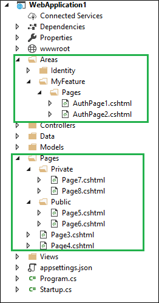

### Authorization in Razor Pages ASP.net Core

#### Introduction
The Authorization is process that determines what a user is able to do this. For example Admin user is allowed to install / remove software from computer and non-Admin user can able to use the software from computer. It is independent and orthogonal  from the Authentication. However, Authorization required an Authentication mechanism. For application first step is always Authentication and Authorization.

Using AuthorizeFilter, we can control the access in our MVC / Web API application by specifying this attribute in controller or action method. Same as there is way to control access in our Razor pages is use authorization conventions at startup. These conventions allow us to authorize users to access individual pages or folders of the pages. Same way, these conventions allow anonymous users to access individual pages or folders of pages. 

To demonstrate the concept, I have create application with ASP.net core Identity. For guidance, how to create application with ASP.net core Identity, please refer my article ["Overview Of Identity In ASP.NET Core 2.0"](https://github.com/jignesht24/Aspnetcore/tree/master/Identity%20Overview%20And%20configuration).

Using AddRazorPagesOptions, we can add an AuthorizeFilter to the page at the specified path. With AddRazorPagesOptions, we have couple of methods that can be used Authorize or allow Anonymous to the page or folder.
##### AuthorizePage

This adds a AuthorizeFilter to the specified page. There are two extension methods: one is accept the page name and other accept page name and authorization policy.
```
public static PageConventionCollection AuthorizePage(this PageConventionCollection conventions, string pageName)
public static PageConventionCollection AuthorizePage(this PageConventionCollection conventions, string pageName, string policy)
```
##### AuthorizeFolder
This adds AuthorizeFilter to all pages under specified folder. There are two extension methods: one is accept the folder path and other accept folder path and authorization policy.
```
public static PageConventionCollection AuthorizeFolder(this PageConventionCollection conventions, string folderPath)
public static PageConventionCollection AuthorizeFolder(this PageConventionCollection conventions, string folderPath, string policy)
```
##### AllowAnonymousToPage
This adds AllowAnonymousFilter to the specified page.
```
public static PageConventionCollection AllowAnonymousToPage(this PageConventionCollection conventions, string pageName)
```
##### AllowAnonymousToFolder
This adds AllowAnonymousFilter to all the pages under the specified folder.
```
public static PageConventionCollection AllowAnonymousToFolder(this PageConventionCollection conventions, string folderPath)
```
##### AuthorizeAreaPage
This is same as AuthorizePage method. It adds AuthorizeFilter to the specified page under the specified Area. It has also extension method that accept the authorization policy.
```
public static PageConventionCollection AuthorizeAreaPage(this PageConventionCollection conventions, string areaName, string pageName)
public static PageConventionCollection AuthorizeAreaPage(this PageConventionCollection conventions, string areaName, string pageName, string policy) 
```
##### AuthorizeAreaFolder
This is same as AuthorizeFolder method. It adds AuthorizeFilter to the all the pages under the specified folder under the specified Area. It has also extension method that accept the authorization policy.
```
public static PageConventionCollection AuthorizeAreaFolder(this PageConventionCollection conventions, string areaName, string folderPath)
public static PageConventionCollection AuthorizeAreaFolder(this PageConventionCollection conventions, string areaName, string folderPath, string policy)
```
##### AllowAnonymousToAreaPage
This add AllowAnonymousFilter to the specified page that located under the specified area.
```
public static PageConventionCollection AllowAnonymousToAreaPage(this PageConventionCollection conventions, string areaName, string pageName)
```
##### AllowAnonymousToAreaFolder
This add AllowAnonymousFilter to all the pages that located under the specified area folder.
```
public static PageConventionCollection AllowAnonymousToAreaFolder(this PageConventionCollection conventions, string areaName, string folderPath)
```
##### Example:

To demonstrate the concept, I have create few pages and following snippet show the folder structure of defined in project



```
public void ConfigureServices(IServiceCollection services)
{
	....
	....
	services.AddMvc().AddRazorPagesOptions(options =>
    {
        options.Conventions.AuthorizePage("/Page3");
        options.Conventions.AuthorizeFolder("/Public");
        options.Conventions.AllowAnonymousToPage("/page4");
        options.Conventions.AllowAnonymousToFolder("Private");

        options.Conventions.AuthorizeAreaPage("MyFeature", "/AuthPage1");
        options.Conventions.AllowAnonymousToAreaPage("MyFeature", "/AuthPage2");
    })
    .SetCompatibilityVersion(CompatibilityVersion.Version_2_1);
}
```
The Authorization conventions can be also applied to [Razor class Library](https://github.com/jignesht24/Aspnetcore/tree/master/RazorClassLibrary/Introduction).
```
public void ConfigureServices(IServiceCollection services)
{
	....
	....
	services.AddMvc().AddRazorPagesOptions(options =>
    {
		....
		....
        //This page defined in Razor Class Library project
        options.Conventions.AuthorizeAreaPage("MyFeature", "/Page1");
		....
		....
    })
    .SetCompatibilityVersion(CompatibilityVersion.Version_2_1);
}
```
#### Combining authorized and anonymous access
We can also specified authorization for the folder and with-in this folder allows anonymous access.
```
services.AddMvc()
    .AddRazorPagesOptions(options =>
    {
		....
		options.Conventions.AuthorizeFolder("/Private").AllowAnonymousToPage("/Private/page8");
		....
	}).SetCompatibilityVersion(CompatibilityVersion.Version_2_1);
```
The reverse case is not allowed i.e. We cannot defined folder for anonymous access and specify a page with-in for authorization. In this case, AllowAnonymousFilter always applied and AuthorizeFilter is ignored. 
```
.AllowAnonymousToFolder("/Private").AuthorizePage("/Private/page8");
```

#### Summary
Using this authorization conventions, we can applied authorization on Razor pages. This conventions can also be applied to [Razor class Library (RCL)](https://github.com/jignesht24/Aspnetcore/tree/master/RazorClassLibrary/Introduction) project if we use in our project. In case of RCL, the conventions are defined in the project that used RCL. 
