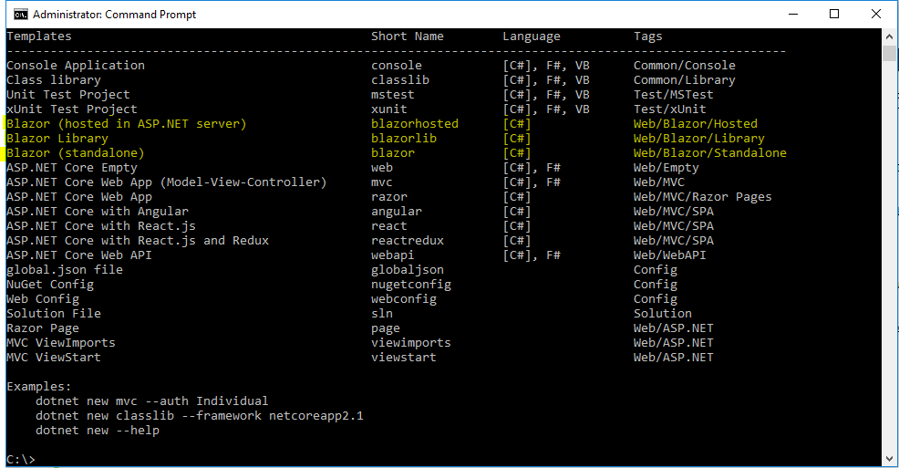
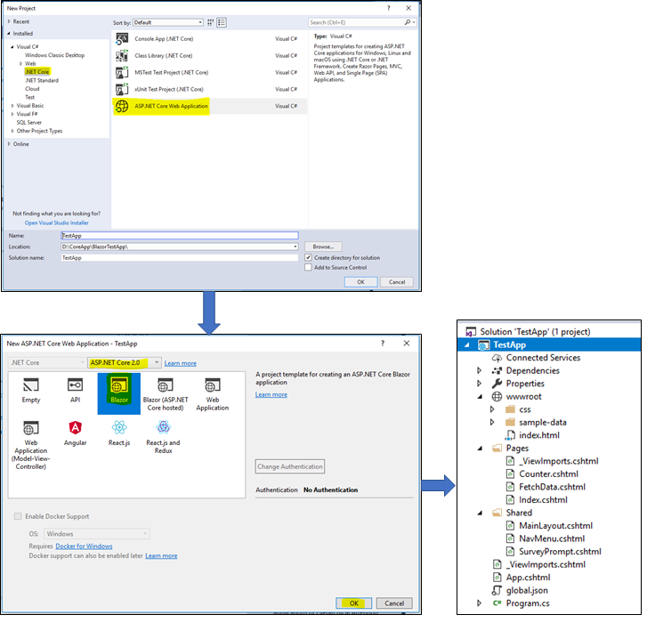
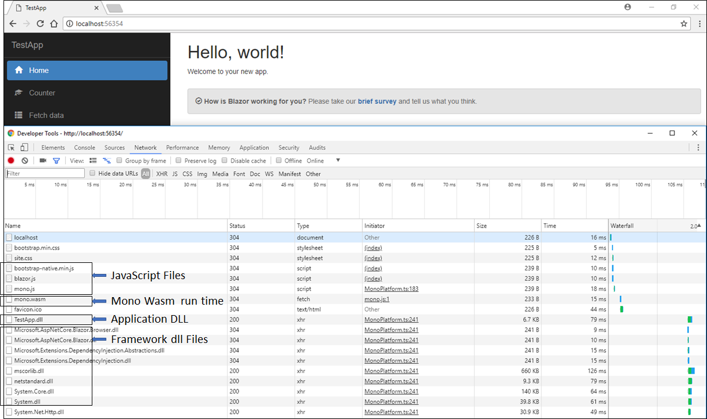
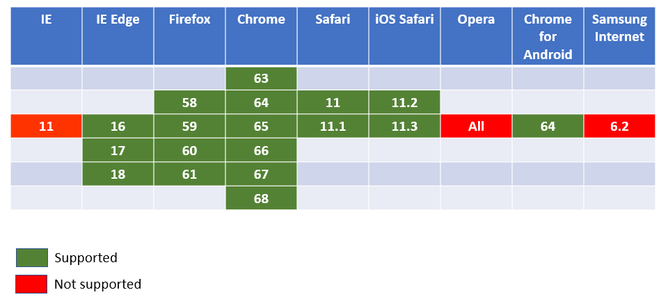
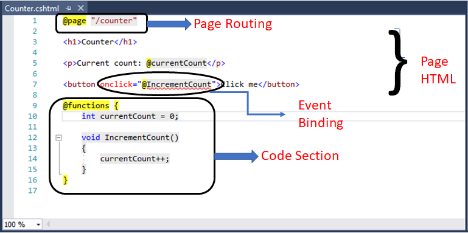

### Introduction
The Blazor is .net web framework which can run in any browser. We can create Blazor application using C#/Razor and HTML. The Blazor application runs in the browser on a real.NET runtime (Mono) via WebAssembly. It enables full stack web development with consistency, stability and  productivity of .NET. Normally, it works with latest browser that support WebAssembly and it works in older browser by falling back to asm.js based .net runtime.

WebAssembly is a web standard which defines a binary format just like lower level assembly language. So, it enables, executing code nearly as fast as running native machine code. It is developed at the W3C (World Wide Web Consortium). It defines an AST (Abstract Syntax Tree) which gets stored in binary format. It is supported by all the major browsers without any plugins. Followings are some feature of WebAssembly.
* Efficient and fast
* Safe: it describes a memory-safe, sandboxed execution environment that may even be implemented inside existing JavaScript virtual machines. It will enforce the same-origin and permissions security policies of the browser When it embedded in the web.
* open and debuggable
* It is part of the open web platform

Mono is a Microsoft .net framework implementation based on the ECMA standards for C# and CLR (Common Language Runtime). Mono 's runtime is compiled in to WebAssembly and its IL interpreter is used to run managed code. 

Blazor is fast, reusable and it is open source hence great support from the community. It works with all the browsers with the need of any plugin.  Following features are supported by Blazor 

A component model for building composable UI
* Routing
* Layouts
* Server-side rendering
* Forms and validation
* Dependency injection
* JavaScript interop
* Live reloading in the browser during development
* Great debugging support in both: browsers and IDE
* Rich IntelliSense and tooling
* Also support older version of browsers (non-WebAssembly) via asm.js
* Publishing and app size trimming

Currently, Blazor is an experimental project and yet not committed to production. Following are some prerequisites that required to getting start with Blazor.
.net Core Framework version: [.NET Core 2.1 Preview 1 SDK] (https://www.microsoft.com/net/download/dotnet-core/sdk-2.1.300-preview2)
latest preview of [Visual Studio 2017 (15.7)] (https://www.visualstudio.com/vs/preview)
Install Project templates and tooling for [Blazor] (https://marketplace.visualstudio.com/items?itemName=aspnet.blazor). Either we can install Blazor templates using command-line

```
dotnet new -i Microsoft.AspNetCore.Blazor.Templates
```


We can create application using Visual Studio or using CLI
Following are steps to create application using Visual Studio
* Select File -> New Project -> Web -> ASP.NET Core Web Application
* Make sure .NET Core and ASP.NET Core 2.0 are selected at the top.
* Pick the Blazor template



Using Following command, we can create Blazor application
```
>dotnet new blazor
```
To Run application, we need to use Ctrl+F5 (application run without debugger). Running application with debugger is not supported at this time.
Before run the application, make sure the correct sdk version supplied in project tag in .csproj file.


Output


The above output image illustrates the boot process of a Blazor application in Chrome browser. It include Blazor' Javascript (blazor.js), Mono’s JavaScript library (mono.js) to bootstrap the Mono runtime (mono.wasm) in WebAssembly, application dll (testApp.dll) and .net framework dlls.

Blazor is not a new Silverlight but there is difference, it does not require a any plugin. It uses Mono's IL linker to reduce the size of your application. As describe earlier WebAssembly is supported by most of the latest browser. Please refer following image to know more about the browser supports. I have taken this reference from [here] (https://developer.mozilla.org/en-US/docs/WebAssembly)



The Blazor template generates view logic inside the Razor template using @functions directive. It generates a single class file that containing C# code in background which representing the view logic. 

Example
```
@page "/"

<!-- View HTML -->

@functions {
    // C# code: functions / events and other logic.
}

```
Many of us dislike this way (mixing view and backend logic in a single file) of doing code but there is a way to separate view and code file. There are three pages automatically created by the template in Pages Folder Index.cshtml, Counter.cshtml, FetchData.cshtml. Let take example of Counter.cshtml to understand, how Blazor works. Following is code snap of Counter.cshtml.



In this page, When I click on "Click Me" button that increments a count each time without a refreshing page. Normally, this kind of behavior would be get by JavaScript, but we have implemented it in C# and .net.

Blazor application are made by Razor view and each razor file consider as a Blazor component. This component is a .net class that defined as a reusable component of web UI. We can add dynamic rendering logic such as loops, expression, conditionals etc. using Razor syntax. At build time, the HTML markup and rendering logic are converted in to component class and name of generated class match with the name of file. In @function directive block, we can have defined component state (such as properties, fields) as well as method s foe event handling. Each time an event occurs on the component, that regenerate its render tree then Blazor will compare the previous render tree with current and apply only modification to the browser DOM.

Routing is defined in Blazor using @page directive. In above example, it is "/counter". Without @page directive we cannot defined routing, but it could be used by the other components. The root component (app.cshtml in our case) contain the information about how router component handled the routing request. It is defined in the app's Program.Main() entry point (defined in Program.cs). Here, we can also configure services with the service provider for the application. 
```
using Microsoft.AspNetCore.Blazor.Browser.Rendering;
using Microsoft.AspNetCore.Blazor.Browser.Services;

namespace TestApp
{
    class Program
    {
        static void Main(string[] args)
        {
            var serviceProvider = new BrowserServiceProvider(services =>
            {
                // Add any custom services here
            });

            new BrowserRenderer(serviceProvider).AddComponent<App>("app");
        }
    }
}
```
Event Binding is quite limited in Blazor. It is supports @onclick and @onchange event. We can also handle child component event in to parent component using OnSomeEvent. 

### Summary
The Blazor is new experimental .NET web framework using C#/Razor and HTML that runs in the browser with WebAssembly. Blazor enables full stack web development with the consistency, stability and productivity of .net. As explain, it is experimental .NET web framework, so many changes are going on. As a result, some portion of this article may become invalid in future.


