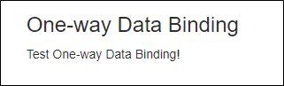
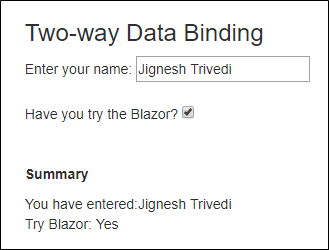
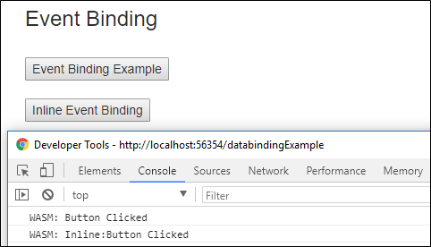
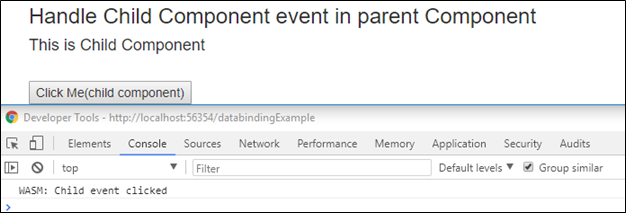
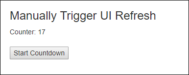

### Introduction
The Blazor is .net web framework which can run in any browser. We can create Blazor application using C#/Razor and HTML. The Blazor application runs in the browser on a real.NET runtime (Mono) via WebAssembly. It enables full stack web development with consistency, stability and  productivity of .NET. Normally, it works with latest browser that support WebAssembly and it works in older browser by falling back to asm.js based .net runtime.

In my [previous article](https://github.com/jignesht24/Aspnetcore/tree/master/Blazor/BlazorIntroduction), I have explain about the Blazor (what is Blazor) and prerequisites that are required to get started with Blazor. In this article, I will explain about the Data Binding with Blazor.

Note: it is an experimental .NET web framework project, so many changes are going on. As a result, some portion of this article may become invalid in the future.

Data binding is one of the most powerful features of software development technologies. Data binding is the connection bridge between View and the business logic (View Model) of the application. Following are the ways of doing data banding with Blazor. 

* One-way Data Binding
* Two-way Data Binding
* Event Binding

### One-way Data Binding
One-way data binding is also known as interpolation in other framework such as Angular. It is very similar to Razor and also it will be  quite straight forward. In one-way binding, we need to pass property or variable name along with @ i.e. @Name (here Name is either the property or variable). In the following example, I have done one-way binding with variable currentTask.
```
@page "/databindingExample"
    <h3>One-way Data Binding</h3>

    <p>
        @currentTask
    </p>  

 @functions {
	string currentTask = "Test One-way Data Binding!";
 }
```
Output:



### Two-way Data Binding
 Blazor is now supports two-way binding. This can be achieve by using "bind" attribute. Current version of Blazor supports the following types for two-way binding.

 * string
 * int
 * DateTime
 * Enum
 * bool

 If we want other types such as decimal, we need to provide getter/setter from supported type. In following example, I have demostate example of string and bool type for two-way binding.
 ```
 @page "/databindingExample"
  <h3>Two-way Data Binding</h3>

    Enter your name: <input type="text" bind=@Name /><br />
    <br />
    Have you try the Blazor? <input type="checkbox" bind="IsTry" /><br />
    <br />
    <br />

    <p><b>Summary</b></p>
    You have entered:@Name <br />
    Try Blazor: @(IsTry ? "Yes" : "No")

@functions {
	public string Name { get; set; }
    public bool IsTry { get; set; }
}
```
Output:



### Event Binding
The current version of Blazor, event binding is very limited. Currently, it only support onclick and on change event. It is under development, so many more event support in new version. Event binding is done by using function name along with @ i.e. @ButtonClicked (here ButtonClicked is function name).

In following Example, I have bind click event with button.
```
@page "/databindingExample"

<h3>Event Binding</h3>
<br />
<button onclick=@ButtonClicked>Event Binding Example</button>
<br />
<br />
<button onclick=@(() => Console.WriteLine("Inline:Button Clicked"))>Inline Event Binding</button>

@functions {
	void ButtonClicked()
	{
        Console.WriteLine("Button Clicked");
	}
}
```
Output



We can also handle child component event into parent component. It can offer the callback that parent component can use to react on event. Following example I have created child component with button and handle child component button event to parent component on OnSomeEvent. 

ChildComponent.cshtml
```
<h4>This is Child Component</h4>
<br />
<button onclick=@OnClick>Click Me(child component)</button>

@functions {
    public Action OnSomeEvent { get; set; }

    private void OnClick()
    {
        OnSomeEvent?.Invoke();
    }
}
```
ParentCompoent
```
@page "/databindingExample"

 <h3>Handle Child Component event in parent Component</h3>
 <ChildComponent OnSomeEvent=@ChildEventClicked />

@functions {
	void ChildEventClicked()
    {
        Console.WriteLine("Child event clicked");
    }
}
```
Output



### Manually Trigger UI Refresh
Blazor automatically detect the necessary UI changes in many scenarios such as button click. However, In some scenarios, we need to trigger UI refresh manually. To do this, BlazorComponent provide method "StateHasChanged" method". In following Example, I have update update the value of currentCount variable in timer event. It is not detect by the Blazor hence we need to call StateHasChanged method tho refresh UI with correct currentCount value.

Example
```
@page "/databindingExample"

    @using System.Threading;
	
	<h3>Manually Trigger UI Refresh</h3>

    Counter: @CurrentCount
    <br />
    <br />
    <button onclick=@Countdown>Start Countdown</button>
@functions {
	void Countdown()
    {
        var timer = new Timer(TimeCallBack, null, 1000, 1000);

    }

    void TimeCallBack(object state)
    {
        if (CurrentCount > 0)
        {
            CurrentCount--;

            // Note:following line is necessary because Blazor would not recognize the state change hence not refresh the UI
            this.StateHasChanged();
        }
    }
} 
```
Output



### Summary
The Blazor is provide one-way and two-way data binding that similar to modern client framework such Angular. It provide event binding with very limited event but many more event support are added in new version. 
