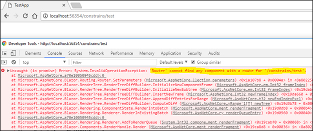
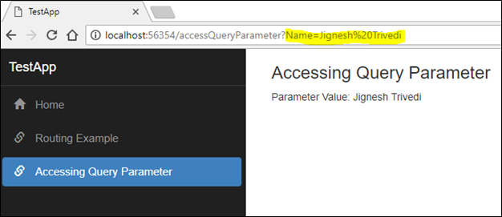

### Introduction

A Route is a URL pattern and Routing is a pattern matching process that monitors the requests and determines what to do with each request. 

Blazor provides client-side router. As compare with Angular router, it has some limited feature. The Microsoft.AspNetCore.Blazor.Routing.Router class provides Routing in Blazor. At the time of initialization, Blazor need assembly that contains the routing i.e. using following code, the router is configured in Blazor application. It is configured in App.cshtml file.
```
<Router AppAssembly=typeof(Program).Assembly />
```

Internally, Blazor's router find all the classes that implement Microsoft.AspNetCore.Blazor.Components.IComponent interface in the specified in above code.

#### @page Attribute/directive
There is only way to define the routing in Blazor using @page directive. In MVC application, we can define routing using multiple ways such as Routing attribute and add value to router table. Each component in Blazor must specify route template using @page directive. The @page directives are internally converted into RouteAttribute when template compile.

Example
```
@page "/testRoute"
<h2>Test App</h2>
```
In Blazor, Component can have multiple routes. If we required that component can render from multiple route value, we need to define all route with multiple @page directives.   

Example
```
@page "/testPage"
@page "/otherPage"
<h2>Test App</h2>
```
If our component has no template i.e. component is written in pure C# class, we can define routing using RouteAttribute.

Example
```
using Microsoft.AspNetCore.Blazor.Components;
using System;

namespace BlazorDemoApp
{
    [Route("/test3")]
    public class Class : IComponent
    {
        public void Init(RenderHandle renderHandle)
        {
            throw new NotImplementedException();
        }

        public void SetParameters(ParameterCollection parameters)
        {
            throw new NotImplementedException();
        }
    }
}
```
Alternatively, we can use BlazorComponent class to create component using C# code.
```
public class MyClass : BlazorComponent
{
       
}
```
#### Handle Parameter in Route Template
Route may have parameter. The parameters can be defined using curly braces with in routing template in both @page directive or RouteAttribute. 

Example  
```
@page "/testRoute/{Parameter1}"

@functions {
    public string Parameter1 { get; set; }
}
```
In blazor, the parameters are directly assigned to properties of the component. The parameter name must match with name of the property on the component. Same as ASP.net MVC, we can also define parameter constraints by placing a constraint name after the parameter name separated by a colon. Using parameter constraints, we can bind specific type to the parameter value.

Example
```
@page "/constrains/{Parameter1:int}"
@functions {
    public int Parameter1 { get; set; }
}
```
So, If someone tried to navigate to this component with string parameter value then the router would not able to match the route hence throw the exception.



#### Linking Pages
We can define links as HTML anchor tag. There are two ways to links pages in Blazor.
* Using Anchor - that we normally used in HTML
* Using NavLink - This is introduced in Blazor

Example
```
<a href="/example1">Navigation Using Anchor tag</a><br />
<NavLink href="/example2">Navigation Using NavLink</NavLink><br />
```
Blazor introduced NavLink tag helper. It is an alternative of HTML anchor tag. It sets the active CSS class automatically if the href matches the current URL.

#### Programmatically navigate one component to another component
We can also navigate from one component to another component by using IUriHelper. This helper has many methods. Using "NavigateTo" method, we can navigate from one component to another. In order to use it, we need to inject services of IUriHelper to our component. We can inject the service using @inject directive in cshtml file or using inject attribute in C# code.

Example
```
@using Microsoft.AspNetCore.Blazor.Services;

@inject IUriHelper UriHelper

<h3>Routing Test</h3>

<button onclick=@ButtonClicked>Programatically Change Routing</button>

@functions {
    void ButtonClicked()
    {
        UriHelper.NavigateTo("example3");
    }
}
```
C# only Component
```
using Microsoft.AspNetCore.Blazor.Components;
using Microsoft.AspNetCore.Blazor.Services;
using System;

namespace BlazorDemoApp
{
    [Route("/test3/{parameter1}")]
    public class MyClass : BlazorComponent
    {
        [Inject]
        public IUriHelper UriHelper { get; set; }
        public void Init(RenderHandle renderHandle)
        {
            throw new NotImplementedException();
        }
    }
}
```
#### Accessing Query Parameters
Most common method is used to pass data from UI to code behind or service is Query String or Query Parameter. We can add query parameter using IUriHelper service. To accessing query parameter, we required to install package "Microsoft.AspNetCore.WebUtilities" from NuGet. Using following command and NuGet package manager, we can install said nuget package in our project.  
```
PM> Install-Package Microsoft.AspNetCore.WebUtilities -Version 2.0.3 
```
Using QueryHelpers.ParseQuery.TryGetValue method we can access the query parameter.

Example
```
@page "/accessQueryParameter"
@using Microsoft.AspNetCore.Blazor.Services;

@inject IUriHelper UriHelper

<h3>Accessing Query Parameter</h3>

<p>
    Parameter Value: @Name
</p>


@functions {


   private string Name { get; set; }

    protected override void OnInit()
    {
        GetName();
        UriHelper.OnLocationChanged += OnLocationChanges;
    }

    private void OnLocationChanges(object sender, string location) => GetName();

    private void GetName()
    {
        var uri = new Uri(UriHelper.GetAbsoluteUri());
        Name = Microsoft.AspNetCore.WebUtilities.QueryHelpers.ParseQuery(uri.Query).TryGetValue("name", out var type) ? type.First() : "";
        StateHasChanged();
    }

    public void Dispose()
    {
        UriHelper.OnLocationChanged -= OnLocationChanges;
    }
}
```


### Summary
Blazor provides client-side router. As compare with Angular router, it has some limited feature. Currently, it provides almost all feature that we required to develop application.  
