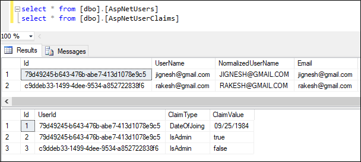
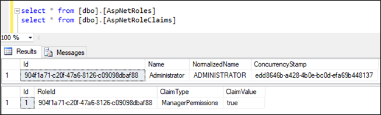

### Claim based and Policy-based authorization with ASP.net Core 2.1

#### Introduction
Authorization is process of determines whether user is able to access the system resource. In [my previous article](https://github.com/jignesht24/Aspnetcore/tree/master/RolebaseAuthorization), I have explain about the role base authorization. The identity membership system is allow us to map one or more roles with user and based on role, we can do authorization. In this article, I will explain how do authorization based on policy and claim.

#### Claim-based authorization
Claims are the user data and they issued by the trusted source. If we are working with token based authentication, Claim may be added with-in token by the server that generate the token. Claim can have any kind of data such as "DateOfJoining", "DateOfBirth", "email", etc. Based on claim that user have, system provides the access of page is called Claim based authorization. For example, system will provide the access of page, if user has "DateOfBirth" claim. In short, claim based authorization check the value of claim and allows access the system resource based on value of claim. 

To demonstrate with an example, I have created 2 users and associate some claim identity with user. I have achieved this by using following code.
```
public void Configure(IApplicationBuilder app, IHostingEnvironment env, IServiceProvider serviceProvider)
{
    ....
	....

    app.UseAuthentication();

    app.UseMvc(routes =>
    {
        routes.MapRoute(
            name: "default",
            template: "{controller=Home}/{action=Index}/{id?}");
    });
    CreateUserAndClaim(serviceProvider).Wait();
}
private async Task CreateUserAndClaim(IServiceProvider serviceProvider)
{
    var UserManager = serviceProvider.GetRequiredService<UserManager<IdentityUser>>();
    IdentityUser user = await UserManager.FindByEmailAsync("jignesh@gmail.com");

    if (user == null)
    {
        user = new IdentityUser()
        {
            UserName = "jignesh@gmail.com",
            Email = "jignesh@gmail.com",
        };
        await UserManager.CreateAsync(user, "Test@123");
    }

    var claimList = (await UserManager.GetClaimsAsync(user)).Select(p => p.Type);
    if (!claimList.Contains("DateOfJoing")){
        await UserManager.AddClaimAsync(user, new Claim("DateOfJoing", "09/25/1984"));
    }
    if (!claimList.Contains("IsAdmin")){
        await UserManager.AddClaimAsync(user, new Claim("IsAdmin", "true"));
    }

    IdentityUser user2 = await UserManager.FindByEmailAsync("rakesh@gmail.com");

    if (user2 == null)
    {
        user2 = new IdentityUser()
        {
            UserName = "rakesh@gmail.com",
            Email = "rakesh@gmail.com",
        };
        await UserManager.CreateAsync(user2, "Test@123");
    }
    var claimList1 = (await UserManager.GetClaimsAsync(user2)).Select(p => p.Type);
    if (!claimList.Contains("IsAdmin"))
    {
        await UserManager.AddClaimAsync(user2, new Claim("IsAdmin", "false"));
    }
}
```


Claim-based authorization can be done by creating policy i.e. create and register policy  that stating the claims requirement. The simple type of claim policy check only for existence of the claim but with advanced level, we can check the user claim with its value. We can also assign more than one values for claim check.

In this following example, I have created the policy that check the 2 claims for user authorization: one for "DateofJoining" and another for "IsAdmin". Here "DateofJoining" is simple type of claim i.e. it only check for claim is exist or not whereas "IsAdmin" claim check with its value.  
```
public void ConfigureServices(IServiceCollection services)
{
	....
	....
	services.AddMvc().SetCompatibilityVersion(CompatibilityVersion.Version_2_1);
    services.AddAuthorization(options =>
    {
        options.AddPolicy("IsAdminClaimAccess", policy => policy.RequireClaim("DateOfJoing"));
        options.AddPolicy("IsAdminClaimAccess", policy => policy.RequireClaim("IsAdmin", "true"));
    });
}
```
We can apply this policy to Authorize attribute using "Policy" property. Here we have to specify the name of the policy.
```
[Authorize(Policy = "IsAdminClaimAccess")]
public IActionResult TestMethod1()
{
    return View("MyPage");
}
```
We can also applied multiple policies to the controller or action. To granted access, all policy must be passed.
```
[Authorize(Policy = "IsAdminClaimAccess")]
[Authorize(Policy = "NonAdminAccess")]
public IActionResult TestMethod2()
{
    return View("MyPage");
}
```
In above examples, we are assign claims to the user and authorize by creating the policy. Alternatively, claims can also be assign to user role, so using this, entre group of user can access the page or resources. I have made little bit change in my code that generate user, user roleand add claims to the roles.
```
private async Task CreateUserAndClaim(IServiceProvider serviceProvider)
{
    var UserManager = serviceProvider.GetRequiredService<UserManager<IdentityUser>>();
    var RoleManager = serviceProvider.GetRequiredService<RoleManager<IdentityRole>>();

    //Added Roles
    var roleResult = await RoleManager.FindByNameAsync("Administrator");
    if (roleResult == null)
    {
        roleResult = new IdentityRole("Administrator");
        await RoleManager.CreateAsync(roleResult);
    }

    var roleClaimList = (await RoleManager.GetClaimsAsync(roleResult)).Select(p => p.Type);
    if(!roleClaimList.Contains("ManagerPermissions"))
    {
        await RoleManager.AddClaimAsync(roleResult, new Claim("ManagerPermissions", "true"));
    }

    IdentityUser user = await UserManager.FindByEmailAsync("jignesh@gmail.com");

    if (user == null)
    {
        user = new IdentityUser()
        {
            UserName = "jignesh@gmail.com",
            Email = "jignesh@gmail.com",
        };
        await UserManager.CreateAsync(user, "Test@123");
    }
	await UserManager.AddToRoleAsync(user, "Administrator");
	....
	....
	....
	....
} 
```


Same as above mention code, we can create policy for role based claim and applied to controller or action method by using Authorize attribute.
```
public void ConfigureServices(IServiceCollection services)
{
	...
	...
	services.AddAuthorization(options =>
	{
		...
		...
		options.AddPolicy("RoleBasedClaim", policy => policy.RequireClaim("ManagerPermissions", "true"));
	});
}
```
```
[Authorize(Policy = "RoleBasedClaim")]
public IActionResult TestMethod3()
{
    return View("MyPage");
}
```

#### Policy-based authorization
The .net core framework allow us to create policies to authorization. we can either use pre-configured policies or can create custom pocily based on our requirement. 

In The role-based authorization and claim-based authorization (refer preceding section), we are using pre-configured policies such as RequireClaim and RequireRole. The policy is contains one or more requirements and register in AddAuthorization service configuration. 

#### Authorization Requirements
The requirement is the collection of data which can be used to evaluate the user principal. To create the requirement, class must implement interface IAuthorizationRequirement that is empty interface. The requirement does not contains any data and evaluation mechanism.

##### Example
In the following example, I have created requirement for minimum time spend to the organization.  
```
public class MinimumTimeSpendRequirement: IAuthorizationRequirement
{
    public MinimumTimeSpendRequirement(int noOfDays)
    {
        TimeSpendInDays = noOfDays;
    }

    protected int TimeSpendInDays { get; private set; }
}
```

#### Authorization handlers
The authorization handler contains the evaluation mechanism for properties of requirement. The handler must evaluate the requirement properties agaist the AuthorizationContext and decide user allowed to access the the system resources or not. One requirement may have multiple handlers. The authorization handler must inherits from AuthorizationHandler<T> class here T is type of requirement class.

##### Example:
In the following example code, I have created handler for the requirement MinimumTimeSpendRequirement. This handler first look for date of joining claim (DateOfJoining). If this claim does not exist for the user, we can mark this as unauthorized request. If the user has claim then we calculate how many days spend by user with-in organization. If this is meet the requirement passed in authorization service then user is authorize to access. I have call context.Succeed(), it mean that user fulfilled all the requirement. 
```
public class MinimumTimeSpendHandler : AuthorizationHandler<MinimumTimeSpendRequirement>
{
    protected override Task HandleRequirementAsync(AuthorizationHandlerContext context, MinimumTimeSpendRequirement requirement)
    {
        if (!context.User.HasClaim(c => c.Type == "DateOfJoining"))
        {
            return Task.FromResult(0);
        }

        var dateOfJoining = Convert.ToDateTime(context.User.FindFirst(
            c => c.Type == "DateOfJoining").Value);

        double calculatedTimeSpend = (DateTime.Now.Date - dateOfJoining.Date).TotalDays;
            
        if (calculatedTimeSpend >= requirement.TimeSpendInDays)
        {
            context.Succeed(requirement);
        }
        return Task.FromResult(0);
    }
}
```
#### Handler registration

The handle that are used authorization must register in service collection. We can add the service collection by using "services.AddSingleton<IAuthorizationHandler, ourHandlerClass>()" method here we need to pass handler class.
```
public void ConfigureServices(IServiceCollection services)
{
	 services.AddMvc().SetCompatibilityVersion(CompatibilityVersion.Version_2_1);
     services.AddAuthorization(options =>
	 {
		...
		...
		options.AddPolicy("Morethan365DaysClaim", policy => policy.Requirements.Add(new MinimumTimeSpendRequirement(365)));
	 }
	 services.AddSingleton<IAuthorizationHandler, MinimumTimeSpendHandler>();
}
```
Handler does not return any value, so a handler indicate the success by calling context.Succeed(requirement) method, here whatever the requirement we are passing that has been successfully validated. If we are not call context.Succeed method, handler get automatically fail or we can call context.Fail() method. 

#### Multiple handlers for a Requirement
In some the cases, we required to evaluate requirement based on OR condition, we can implement multiple handlers for the single requirement. For example, we have requirement like page can be access by the user if he is spend atleast 365 days in organization or user from the HR department. In this case we have single requirement to access the page nut multiple handlers for validating a single requirement. 

##### Example
```
using Microsoft.AspNetCore.Authorization;
using System;
using System.Threading.Tasks;

namespace ClaimBasedPolicyBasedAuthorization.Policy
{
    public class PageAccessRequirement : IAuthorizationRequirement
    {
    }

    public class TimeSpendHandler : AuthorizationHandler<PageAccessRequirement>
    {
        protected override Task HandleRequirementAsync(AuthorizationHandlerContext context, PageAccessRequirement requirement)
        {
            if (!context.User.HasClaim(c => c.Type == "DateOfJoining"))
            {
                return Task.FromResult(0);
            }

            var dateOfJoining = Convert.ToDateTime(context.User.FindFirst(
                c => c.Type == "DateOfJoining").Value);

            double calculatedTimeSpend = (DateTime.Now.Date - dateOfJoining.Date).TotalDays;

            if (calculatedTimeSpend >= 365)
            {
                context.Succeed(requirement);
            }
            return Task.FromResult(0);
        }
    }
    public class RoleCheckerHandler : AuthorizationHandler<PageAccessRequirement>
    {
        protected override Task HandleRequirementAsync(AuthorizationHandlerContext context, PageAccessRequirement requirement)
        {
            if (!context.User.HasClaim(c => c.Type == "IsHR"))
            {
                return Task.FromResult(0);
            }

            var isHR = Convert.ToBoolean(context.User.FindFirst(c => c.Type == "IsHR").Value);

            if (isHR)
            {
                context.Succeed(requirement);
            }
            return Task.FromResult(0);
        }
    }
}
```
Here, We need to register both the handler. Any one handler of two succeeds , the policy evaluation succeed.
```
public void ConfigureServices(IServiceCollection services)
{
	....
	....
	....
	services.AddAuthorization(options =>
	{
		....
		....
		options.AddPolicy("AccessPageTestMethod5", policy => policy.Requirements.Add(new PageAccessRequirement()));
	});
	...
	...
	services.AddSingleton<IAuthorizationHandler, TimeSpendHandler>();
    services.AddSingleton<IAuthorizationHandler, RoleCheckerHandler>();
} 
```
Using RequireAssertion policy builder method, we can add simple expression for the policy without requirement and handler. The code mention for above example can be re-written as following
```
services.AddAuthorization(options =>
{
    ...
	....
    options.AddPolicy("AccessPageTestMethod6",
        policy => policy.RequireAssertion(context =>
            context.User.HasClaim(c =>
            (c.Type == "IsHR" && Convert.ToBoolean(context.User.FindFirst(c2 => c2.Type == "IsHR").Value)) ||
            (c.Type == "DateOfJoining" && (DateTime.Now.Date - Convert.ToDateTime(context.User.FindFirst(c2 => c2.Type == "DateOfJoining").Value).Date).TotalDays >= 365))
            ));
});
```
#### Can we Access request Context in Handlers?

The HandleRequirementAsync method contains two parameters AuthorizationContext and Requirement. Some of the frameworks such as MVC, allowed to add any object to the Resource property of the AuthorizationContext to pass an extra information. This Resource property is specific to framework, so we can cast context.Resource object to appropriate context and access the resources
```
var myContext = context.Resource as Microsoft.AspNetCore.Mvc.Filters.AuthorizationFilterContext;

if (myContext != null)
{
    // Examine MVC specific item.
	var controllerName = ((Microsoft.AspNetCore.Mvc.Controllers.ControllerActionDescriptor)myContext.ActionDescriptor).ControllerName;
}
```
#### Summary
Claim-based authorization allows us to validate the user based on other characteristics such as username, date of joining, employee, other information, etc. Probably it is not possible with another kind of authorization such as role-based authorization. The claim-based authorization can be achieved by the policy based authorization by using a pre-configured policy. We can either use pre-configured policies or can create a custom policy based on our requirement for authorization.
