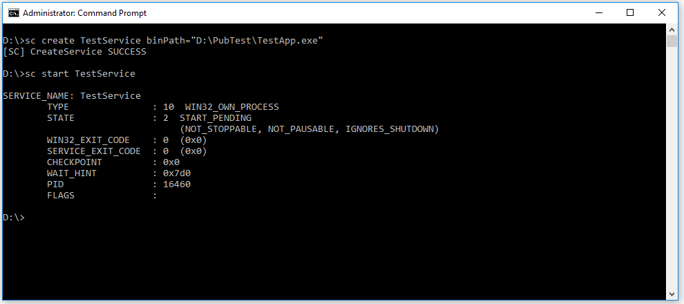
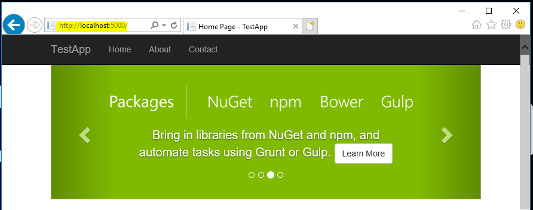
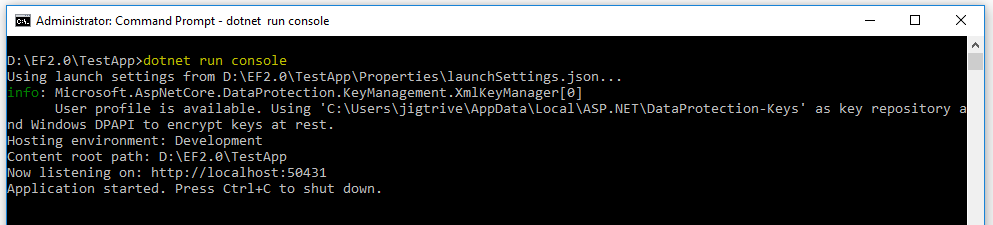

### Introduction
ASP.net core application can be hosted using various way such as Hosted with IIS, Hosted with HTTP.sys Server, etc. This article is to about hosting ASP.net core application as Windows service. Windows services feature is available only with Windows platform. This is one of the way to host Asp.net core application on Windows platform without using IIS. 

Implementation of Hosting a Asp.net core application as windows services is not relevant on dotnet core. When application hosted as windows service, it can start/stop automatically if service is start/ stop. 

When Asp.net core application host as windows service, the application must run on the .NET Framework, so we need to specify appropriate values for TargetFramework in csproj file. To demonstrate the example, I have run my application on .NET Framework 4.6.1.
```
<PropertyGroup>
  <TargetFramework>net461</TargetFramework>
</PropertyGroup>  
```
First step is install Microsoft.AspNetCore.Hosting.WindowsServices package from nuget. This package can install either by using nuget package manager or by using .net core CLI

Using nuget Package Manager
```
PM > Install-Package Microsoft.AspNetCore.Hosting.WindowsServices
```
Using .Net core CLI
```
> dotnet add package Microsoft.AspNetCore.Hosting.WindowsServices
```
This package contains the extension method named "RunAsService" for IWebHost. This extension method runs the specified web application as a windows service and port is blocks until the service is stopped. Here we want to run our application as service, so we need to call IWebHost.RunAsService() method instead of IWebHost.Run() in Main method of program.cs file. Also, we need to specify the path for content root directory to publish location.

Program.cs
```
using Microsoft.AspNetCore;
using Microsoft.AspNetCore.Hosting;
using Microsoft.AspNetCore.Hosting.WindowsServices;
using System.Diagnostics;
using System.IO;

namespace TestApp
{
    public class Program
    {
        public static void Main(string[] args)
        {
            var pathToExe = Process.GetCurrentProcess().MainModule.FileName;
            var pathToContentRoot = Path.GetDirectoryName(pathToExe);

            var host = WebHost.CreateDefaultBuilder(args)
                .UseContentRoot(pathToContentRoot)
                .UseStartup<Startup>()
                .Build();

            host.RunAsService();
        }
    }
}
```
Next step is to publish application and register as windows service. To register windows service, open a command shell with administrative privileges and using sc.exe command-line tool to create and start a service. In following command, binPath is a executable of application.
```
>sc create TestService binPath="D:\PubTest\TestApp.exe"
>sc start TestService
```


When above command execute successfully and Windows service has started, we can browse same path as when running without service(i.e. default url is http://localhost:5000)



### Provide a way to host application outside of a service
When running and hosted the application as a windows service, it is very difficult to debug. So we can add condition on that application does not run as service. 
```
public static void Main(string[] args)
{
    var pathToExe = Process.GetCurrentProcess().MainModule.FileName;
    var pathToContentRoot = Path.GetDirectoryName(pathToExe);

    IWebHost host;

    if (Debugger.IsAttached || args.Contains("console"))
    {
        Debugger.Launch();
        host = WebHost.CreateDefaultBuilder()
                .UseContentRoot(Directory.GetCurrentDirectory())
                .UseStartup<Startup>()
                .Build();
        host.Run();
    }
    else
    {
        host = WebHost.CreateDefaultBuilder(args)
                .UseContentRoot(pathToContentRoot)
                .UseStartup<Startup>()
                .Build();
        host.RunAsService();
    }
}
```
Now I am running my application using dotnet run commad and pass "console" string as argument, so .NET framework hosts our application on port configured in launchSettings.json.
```
> dotnet run console
```


### Handle starting and stopping events of Windows service
To handle OnStarting, OnStarted, and OnStopping events, we need to register our own WebHostService class that have these methods. Following are the steps such events

1. Create web host service class which derives from WebHostService class
```
public class MyWebHostService : WebHostService
{
    public MyWebHostService(IWebHost host) : base(host)
    {
    }

    protected override void OnStarting(string[] args)
    {
        System.Diagnostics.Debugger.Launch();
        base.OnStarting(args);
    }

    protected override void OnStarted()
    {
        base.OnStarted();
    }

    protected override void OnStopping()
    {
        base.OnStopping();
    }
}
```
2. Next step is to create extension method for IWebHost that register our custom WebHostService and passes to ServiceBase.Run method. 
```
public static class WebHostServiceExtensions
{
    public static void RunAsCustomService(this IWebHost host)
    {
        var webHostService = new MyWebHostService(host);
        ServiceBase.Run(webHostService);
    }
}
```
3. Now we need to call new extension method RunAsCustomService instead of RunAsService in Program.Main method.
```
public static void Main(string[] args)
{
    var pathToExe = Process.GetCurrentProcess().MainModule.FileName;
    var pathToContentRoot = Path.GetDirectoryName(pathToExe);

    var host = WebHost.CreateDefaultBuilder(args)
        .UseContentRoot(pathToContentRoot)
        .UseStartup<Startup>()
        .Build();

    host.RunAsCustomService();
}
```
If we want any service that required in our custom service from dependency injection such as a logger that can be obtains from IWebHost.Services property using GetRequiredService method.
```
public class MyWebHostService : WebHostService
{
    private ILogger _logger;

    public MyWebHostService(IWebHost host) : base(host)
    {
        _logger = host.Services.GetRequiredService<ILogger<MyWebHostService>>();
    }

	...
	...
}
```
### Summary
This article explains about hosting asp.net core application as windows service. This is one of the recommended way to host an ASP.NET Core application on Windows without using IIS.  