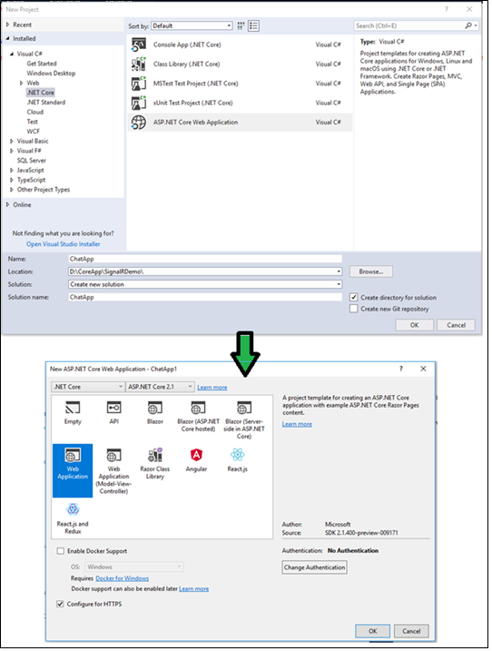
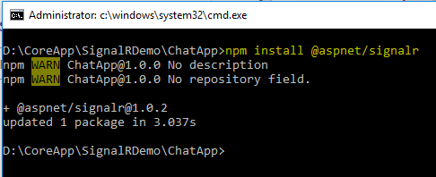
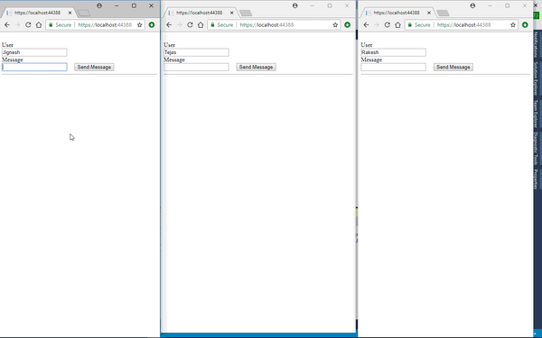

### Introduction
SignalR is an open source library that adding real-time web functionality to application. It means, it enable the serverside to push the content to client instantly rather than the server wait for client to request for new data. It provides an API for creating server to client RPC (remote procedure calls). The RPC call javascript functions on client from server side .net core code.

SignalR can be used for:
* Application that required higt frequency updates from server such as social networking, voating ect.
* Application that required notification such as email, games, etc.
* Dashboards and monitoring application

SignalR has been rewritten for ASP.net core 2.1. It includes following improvements
* No JQuery dependency
* Support custom protocols
* A new compact binary protocol based on MessagePack
* Streaming response model
* Simplified scale-out model
* WebSockets support

Following are some features of SignalR
* It handles connection management automatically
* Able to send the message to all connected client simultaneously
* Able to send the message to specific client or groups of client
* Scales in / out automatically to handle traffic

SignalR supports many techniques for handling real-time communications such as Web Sockets, Server-Sent Events, Long polling. It automatically select he best transport method which suitable for server and client.

Hubs

The Hubs are used to communicate between server and client in SignalR. It is a high level pipeline that allows the client and server to call methods on each other. SignalR automatically handles the dispatching across machine boundaries that allows server to call methods on the client and vice versa. 

SignalR provides two built-in hub protocols
* Text protocol (based on JSON) 
* Binary Protocol (based on MessagePack)

[MessagePack](https://msgpack.org/) creates smaller message than the JSON. Older browser must support XHR level2 to provide support to MessagePack.

Hubs call client side method by sending the messages which contains name of the method and its parameter. This method parameter are de-serialized using the configured protocol. The client, match the name of method, if it found it calls the method and pass the de-serialized parameter data.

Get started with SignalR

In this Example, I have create simple Chat application. 

Following software are installed to develop application with SignalR on ASP.net core
* [Node packge manager(npm)](https://www.npmjs.com/get-npm)
* [.NET Core SDK 2.1 or later](https://www.microsoft.com/net/download/all)
* Visual Studio 2017 (Version 15.7.3 or later) Or Visual Studio code

First step to create web application. The web application can either create by using Visual Studio or CLI.


```
dotnet new webapp
```
Next step is to download SingleR module using node package manager.
```
npm init -y
npm install @aspnet/signalr
```


Next step is to copy signalr.js file from "node_modules\@aspnet\signalr\dist\browser" to appropriate folder of our project. In this demo I have created folder "singler" under inside the wwwroot/lib folder and paste this file.

Do not forget to include signalr.js file into script tag.

### Create SignalR Hub

The SignalR hub is class that inherit from Microsoft.AspNetCore.SignalR.Hub. In this class, We can crate method that can be accessed from JavaScript. To send message to all client, I have created "SendMessage" method and Within this method, I have call the "RecieveMessage" method of connected client.
```
using Microsoft.AspNetCore.SignalR;
using System.Threading.Tasks;
namespace ChatApp
{
    public class ChatHub : Hub
    {
        public async Task SendMessage(string user, string message)
        {
            await Clients.All.SendAsync("ReceiveMessage", user, message);
        }
    }
}
```
Next is to configure our project that handle the SignalR Request. To configure SignalR in our project, we need to add signalR service to ConfigureService method of startup class. 
```
public void ConfigureServices(IServiceCollection services)
{
	....
	....
	services.AddSignalR();
}
```
Also, we need to configure the route to SignalR hubs using UseSignalR method defined in Configure method of startup class. This method(app.UseSignalR) adds SignalR to a middleware pipeline.
```
public void Configure(IApplicationBuilder app)
{
	...
	...
	app.UseSignalR(routes =>
    {
           routes.MapHub<ChatHub>("/chatHub");
     });

	 app.UseMvc();
}
```
Using following JavaScript code, we can call the server method "SendMessage" and also we have register ReceiveMessage method, that can be called from server to send send the message to client. This code is written for modern ECMAScript 6, so this code will not work with IE 11 and the other browser that not support ECMAScript 6. 

In this demo, I have created chat.js file under "wwwroot/js" folder.

```
const connection = new signalR.HubConnectionBuilder()
    .withUrl("/chatHub")
    .build();

//This method receive the message and Append to our list
connection.on("ReceiveMessage", (user, message) => {
    const msg = message.replace(/&/g, "&amp;").replace(/</g, "&lt;").replace(/>/g, "&gt;");
    const encodedMsg = user + " :: " + msg;
    const li = document.createElement("li");
    li.textContent = encodedMsg;
    document.getElementById("messagesList").appendChild(li);
});

connection.start().catch(err => console.error(err.toString()));

//Send the message

document.getElementById("sendMessage").addEventListener("click", event => {
    const user = document.getElementById("userName").value;
    const message = document.getElementById("userMessage").value;
    connection.invoke("SendMessage", user, message).catch(err => console.error(err.toString()));
    event.preventDefault();
}); 
```
For the Demo purpose, I have replace following content in Pages\index.cshtml file.
```
@page
<div class="container">
    <div class="row">&nbsp;</div>
    <div class="row">
        <div class="col-md-12">
            <div class="col-md-6">
                <div class="col-md-3">User</div>
                <div class="col-md-9"><input type="text" id="userName" /></div>
            </div>
        </div>
        <div class="col-md-12">
            <div class="col-md-6">
                <div class="col-md-3">Message</div>
                <div class="col-md-9">
                    <input type="text" id="userMessage" /> &nbsp;&nbsp;&nbsp;
                    <input type="button" id="sendMessage" value="Send Message" />
                </div>
            </div>
        </div>
    </div>
    <div class="row">
        <div class="col-12">
            <hr />
        </div>
    </div>
    <div class="row">
        <div class="col-6">&nbsp;</div>
        <div class="col-6">
            <ul id="messagesList"></ul>
        </div>
    </div>
</div>
<script src="~/lib/signalr/signalr.js"></script>
<script src="~/js/chat.js"></script>
```
Output:

