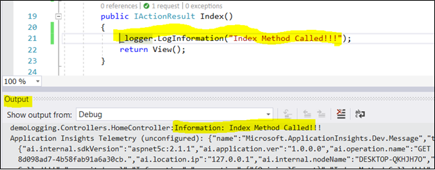
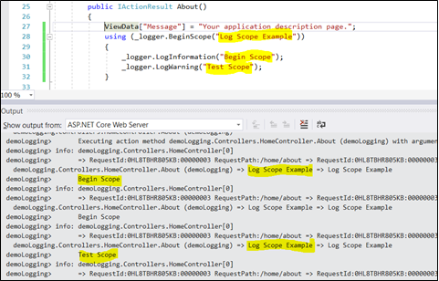

### Introduction
 
Logging is a very critical and essential part of any software. It helps us in the investigation of the essence of problems. Before ASP.NET Core, we had to use third party libraries for logging our application.
 
ASP.NET Core has built-in support for logging APIs that is able to work with various logging providers. Using these built-in providers, we can send application logs to one or more destinations and also, we can plug in third party logging framework.
 
To enable Logging in the earlier version ASP.net core (.net core 1.x), it is required to add dependency within Project.json or .csproj file and needs some configuration under startup class to add into DI. Also if we want to add any third party provider or configure filtering, we need to configuration in startup class. In this new version (.net core 2.0) of framework, Logging is added into DI system by default. Also if we want to add any configuration or add any third party provider, configuration is done under main function (program.cs file) instead of startup class.
 
### How to add providers
 
To enable the service of logging, we need to add the provider extension method in ConfigureLogging method of instance of WebHostBuilder class under main function. A logging provider takes a message which we create with ILogger object and display or store them. To use provider, we need to call "Add<Provider Name>" extension method under main function.
```
public static void Main(string[] args)  
{  
    var webHost = new WebHostBuilder()  
        .UseKestrel()  
        .UseContentRoot(Directory.GetCurrentDirectory())  
        .ConfigureLogging((hostingContext, logging) =>  
        {  
            logging.AddConfiguration(hostingContext.Configuration.GetSection("Logging"));  
            logging.AddConsole();  
            logging.AddDebug();  
        })  
        .UseStartup<Startup>()  
        .Build();  
  
    webHost.Run();  
}  
```
The WebHostBuilder class has CreateDefaultBuilder method. The ConfigureLogging method call is done by this method. The following code will be generated when we create MVC application using .net core 2.0.
```
public class Program  
{  
    public static void Main(string[] args)  
    {  
        BuildWebHost(args).Run();  
    }  
  
    public static IWebHost BuildWebHost(string[] args) =>  
        WebHost.CreateDefaultBuilder(args)  
            .UseStartup<Startup>()  
            .Build();  
}  
```
### How to create logs
 
As discussed, Logger is available as DI (dependency injection) to the every controller by default. So we get an ILogger object in the constructor of the controller class.
```
public class HomeController : Controller  
{  
    private readonly ILogger _logger;  
    public HomeController(ILogger<HomeController> logger)  
    {  
        _logger = logger;  
    }  
}  
```
After this, call logging methods on the logger object that get in DI container.
```
public IActionResult Index()  
{  
    _logger.LogInformation("Index Method Called!!!");  
    return View();  
}  
```



The above methods (such as LogInformation etc.) are extension methods of log method. They internally pass the log level. We can also call the log method instead of these extension methods. The syntax of this method is relatively complicated. Log level has following possible values.
* Critical (LogCritical)
* Debug (LogDebug)
* Error (LogError)
* Information (LogInformation)
* Trace (LogTrace)
* Warning (LogWarning)
* Log filtering
As ASP.net core 1.x, we can also specify a minimum log level for a specific or all provider and specific or all category. Any logs below the minimum level is not passed to the provider hence it does not get displayed or stored. If we specify the log level to LogLevel.None as minimum log level, all the logs are suppressed.
 
The Code created by project template that call CreateDefaultBuilder method to setup logging and it setup logging for console and debug providers. We can apply logging filter rules from code as well as using JSON file.
 
### Filter rules using JSON file
 
We can also specify logging rules by using JSON file. We can add logging configuration by using following code. Here I have placed fthe ollowing code instead of CreateDefaultBuilder method that created by template.
```
public static void Main(string[] args)  
{  
    var webHost = new WebHostBuilder()  
        .UseKestrel()  
        .UseContentRoot(Directory.GetCurrentDirectory())  
        .ConfigureAppConfiguration((hostingContext, config) =>  
        {  
            var env = hostingContext.HostingEnvironment;  
            config.AddJsonFile("appsettings.json", optional: true, reloadOnChange: true)  
                    .AddJsonFile($"appsettings.{env.EnvironmentName}.json", optional: true, reloadOnChange: true);  
            config.AddEnvironmentVariables();  
        })  
        .ConfigureLogging((hostingContext, logging) =>  
        {  
            logging.AddConfiguration(hostingContext.Configuration.GetSection("Logging"));  
            logging.AddConsole();  
            logging.AddDebug();  
        })  
        .UseStartup<Startup>()  
        .Build();  
  
    webHost.Run();  
}  
```
The configuration specifies the minimum log levels by provider and category.
```
{  
  "Logging": {  
    "IncludeScopes": false,  
    "Debug": {  
      "LogLevel": {  
        "Default": "Information"  
      }  
    },  
    "Console": {  
      "LogLevel": {  
        "Microsoft.AspNetCore.Mvc.Razor": "Error",  
        "Default": "Information"  
      }  
    },  
    "LogLevel": {  
      "Default": "Debug"  
    }  
  }  
}  
```
The above example JSON create four filter rules
* One rule for Debug provider
* Two rules for Console Provider
* One rule that applied to all provider
Later on, we will see how one of these rules is chosen for each provider when an ILogger object is created.
 
### Filter rules in Code
 
We can also register filter rules in code. Using AddFilter Method, we can specify the filter rules. In the following example, I have added two filter rules: Fir rule applied to the all the provider and second rule is applied on the Debug provider.
```
public static IWebHost BuildWebHost(string[] args) =>  
    WebHost.CreateDefaultBuilder(args)  
        .ConfigureLogging(logging =>  
            logging.AddFilter("System", LogLevel.Debug)  
                .AddFilter<Microsoft.Extensions.Logging.Debug.DebugLoggerProvider>("Microsoft", LogLevel.Trace)  
                )  
        .UseStartup<Startup>()  
        .Build();  
```
### How filtering rules are applied
 
In the preceding section, the configuration data and AddFilter method create the filter rules. When ILogger object write logs with the ILoggerFactory object, it select a single rule per provider and applied to the logger. All messages written or stored by the ILogger object are filter based on the selected rule.
 
The following algorithm is used for selecting the filter for ach provider for given category.
Select all the rules which match the provider. If none are found, select all rules with no provider
From the above step result, select rules with longest matching category prefix. If none are found, select all rules which does not specify the category
If multiple rules are found, select last one
If no rules are selected then use minimum level
Set Default minimum level
 
We can set the minimum level setting which takes effect only if no rules from code or configuration apply to the given provider and category.
```
public static IWebHost BuildWebHost(string[] args) =>  
    WebHost.CreateDefaultBuilder(args)  
        .ConfigureLogging(logging => logging.SetMinimumLevel(LogLevel.Warning))  
        .UseStartup<Startup>()  
        .Build();  
```
If we do not set the minimum level, the default value is Information, so “Debug” and “Trace” logs are ignored.
 
### Filter functions
 
We can write code in filter function to apply rules. This filter function is invoked for all providers and categories which do not have rules assigned to them by code or configuration. Within this function, we can access provider type, category and log level to decide whether message should be logged or not.
 
In the following example, message is not logged if provider type is console and category is HomeController.
```
public static IWebHost BuildWebHost(string[] args) =>  
WebHost.CreateDefaultBuilder(args)  
    .UseStartup<Startup>()  
    .ConfigureLogging(logBuilder =>  
    {  
        logBuilder.AddFilter((provider, category, logLevel) =>  
        {  
            if (provider == "Microsoft.Extensions.Logging.Console.ConsoleLoggerProvider" &&  
                category == "demoLogging.Controllers.HomeController")  
            {  
                return false;  
            }  
            return true;  
        });  
    })  
    .Build();  
```
### Log scopes
 
Logging framework allows us to group a set of logical operations within the log scope, in order to assign the same data to each log which is part of this set.
 
A scope is an IDisposable type which returned by ILogger.BeginScope<TState> method and lasts until it is disposed. Using "using" block, we can use a scope.
 
#### Enable the scope
```
public static IWebHost BuildWebHost(string[] args) =>  
    WebHost.CreateDefaultBuilder(args)  
        .ConfigureLogging((hostingContext, logging) =>  
        {  
            logging.AddConfiguration(hostingContext.Configuration.GetSection("Logging"));  
            logging.AddConsole(options => options.IncludeScopes = true);  
            logging.AddDebug();  
        })  
        .UseStartup<Startup>()  
        .Build();  
```
Conroller
```
public IActionResult About()  
{  
    ViewData["Message"] = "Your application description page.";  
    using (_logger.BeginScope("Log Scope Example"))  
    {  
        _logger.LogInformation("Begin Scope");  
        _logger.LogWarning("Test Scope");  
    }  
    return View();  
} 
``` 
Output



### Built-in logging providers

Same ASP.net core 1.x, ASP.net Core 2.0 provides the following built-in providers for logging.
* Console
* Debug
* EventSource
* EventLog
* TraceSource
* Azure App Service

Following third party logging framework that supported by ASP.net core
* elmah.io provider for the Elmah.Io service
* Loggr provider for the Loggr service
* NLog provider for the NLog library
* Serilog provider for the Serilog library
* JSNLog - logs JavaScript exceptions and it also log other client-side events in your server-side log

We can also create our own provider that uses other logging frames internally or has its own logging related requirement.
 
### Summary
 
ASP.NET Core 2.0 provides very basic and powerful built-in logging framework. It is very similar to logging framework in .net core 1.x. There is slightly different in configuration between new and old framework. We can integrate this with third party logging frameworks, such as Nlog, Serilog etc. We can also create our own provider based on our requirement.