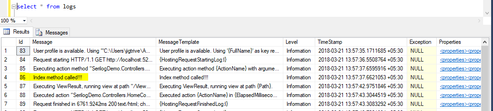
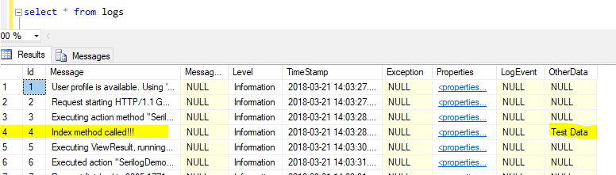

### Introduction 
[Logging](https://github.com/jignesht24/Aspnetcore/blob/master/Logging%20with%20.net%20core%202.0/Basic%20Logging%20Framework/Readme.md)  is a very critical and essential part of any software. It helps us in the investigation of the essence of problems. ASP.NET Core has built-in support for logging API's, which is able to work with various logging providers. Using these built-in providers, we can send application logs to one or more destinations and also, we can plug in third party logging frameworks such as Serilog, Nlog, etc.

Serilog is a good logging framework and it is built with the structured log data in mind. It is a kind of serializer. Serilog determines the right representation when the properties are specified in log events. To use Serilog logging feature with ASP.NET core 2.0, we need to add the dependency of "Serilog.AspNetCore". Serilog provides variety of [sinks](https://github.com/serilog/serilog/wiki/Provided-Sinks) such as file, MSSQL, Log4net, PostgreSQL,  etc.

In this artcle, I will explain about serilog MS SQL sink with Asp.net core 2.0. After adding respective package of serilog, we need to add UseSerilog() to the web host builder in BuildWebHost().
```
public static IWebHost BuildWebHost(string[] args) =>
    WebHost.CreateDefaultBuilder(args)
        .UseStartup<Startup>()
        .UseSerilog()
        .Build();
```
Serilog provide sink that writes events to the MS Sql Server. Currently NoSql is very famous due to provide more flexibility to store the different kinds of properties but sometime it is easier to use existing MS Sql Server to log the events. The sink "Serilog.Sinks.MSSqlServer" will write the events data to Sql table. This sink will works with .net framework 4.5 and .net Standard 2.0. We can add this sinks by using either nuget package manager or .net CLI

Using Package Manager
```
PM> Install-Package Serilog.Sinks.MSSqlServer 
```
Using .net CLI
```
> dotnet add package Serilog.Sinks.MSSqlServer 
```
To configure this sink in c# code, we need to call WriteTo.MSSqlServer method during logger configuration. The logger configuration are need to write in program.Main method. There are two minimum configuration required: connection string and table name. Following code is use to configure MSSqlServer sink.
```
var connectionString = @"Data Source=(local); Initial Catalog=Test;User ID=sa;Password=Passwd@12;";
var tableName = "Logs";

var columnOption = new ColumnOptions();
columnOption.Store.Remove(StandardColumn.MessageTemplate);

Log.Logger = new LoggerConfiguration()
                .MinimumLevel.Information()
                .MinimumLevel.Override("SerilogDemo", LogEventLevel.Information)
                .WriteTo.MSSqlServer(connectionString, tableName, columnOptions: columnOption)
                .CreateLogger();
```
Following is table definition
```
CREATE TABLE [dbo].[Logs](
	[Id] [int] IDENTITY(1,1) NOT NULL,
	[Message] [nvarchar](max) NULL,
	[MessageTemplate] [nvarchar](max) NULL,
	[Level] [nvarchar](128) NULL,
	[TimeStamp] [datetimeoffset](7) NOT NULL,
	[Exception] [nvarchar](max) NULL,
	[Properties] [xml] NULL,
	[LogEvent] [nvarchar](max) NULL,
 CONSTRAINT [PK_Logs] PRIMARY KEY CLUSTERED 
(
	[Id] ASC
)WITH (PAD_INDEX = OFF, STATISTICS_NORECOMPUTE = OFF, IGNORE_DUP_KEY = OFF, ALLOW_ROW_LOCKS = ON, ALLOW_PAGE_LOCKS = ON) ON [PRIMARY]
) ON [PRIMARY] TEXTIMAGE_ON [PRIMARY]
```
Following are the columns that can be used by this sink. We can modify the column name of database table using columnOptions.

* StandardColumn.Message
* StandardColumn.MessageTemplate
* StandardColumn.Level
* StandardColumn.TimeStamp
* StandardColumn.Exception
* StandardColumn.Properties

By default all the column are inserted when this sink perform log operation. We can change this list by adding or removing the columns using columnOptions.
```
//Remove the column
columnOptions.Store.Remove(StandardColumn.Properties);

//Add the column
columnOptions.Store.Add(StandardColumn.Exception);
```
We can also add our own log event properties in logs table.They can be added by using AdditionalDataColumns property of columnOption. For example, I have added "OtherData" property to the logs table and also added to AdditionalDataColumns property.

By using following Sql query, we can add column to logs table
```
Alter table logs add OtherData Varchar(50);
```
By using following code, we can added column to AdditionalDataColumns property.
```
columnOption.AdditionalDataColumns = new Collection<DataColumn>
            {
                new DataColumn {DataType = typeof (string), ColumnName = "OtherData"},
            };


Log.Logger = new LoggerConfiguration()
                .MinimumLevel.Information()
                .MinimumLevel.Override("SerilogDemo", LogEventLevel.Information)
                .WriteTo.MSSqlServer(connectionString, tableName,
                        columnOptions: columnOption

                        )
                .CreateLogger();
```


The log event property OtherData will be added in corresponding column upon logging. The property name must match a column name in logs table.

The value of additional property can be set by using ForContext property of ILogger class. Following example, I have assign OtherData property to "Test Data". 
```
using Microsoft.AspNetCore.Mvc;
using Serilog;

namespace SerilogDemo.Controllers
{
    public class HomeController : Controller
    {
        public IActionResult Index()
        {
            Log.Logger.ForContext("OtherData", "Test Data").Information("Index method called!!!");
            return View();
        }
    }
}
```


We can do same configuration using JSON file. In following example, I have pass connection string and table name to appsetting.json file under "Serilog" node. 
```
appSettings.json 

{
  "Serilog": {
    "Using": [ "Serilog.Sinks.MSSqlServer" ],
    "MinimumLevel": "Information",
    "WriteTo": [
      {
        "Name": "MSSqlServer",
        "Args": {
          "connectionString": "Data Source=(local); Initial Catalog=Test;User ID=sa;Password=Passwd@12;", // connection String
          "tableName": "logs" // table name
        }
      }
    ]
  }
}
```
Using LoggerConfiguration.ReadFrom.Configuration method, we can read our configuration file and our logger is work according to our configuration.
```
var configuration = new ConfigurationBuilder()
.AddJsonFile("appsettings.json")
.Build();

Log.Logger = new LoggerConfiguration()
    .ReadFrom.Configuration(configuration)
    .CreateLogger();
 ```

