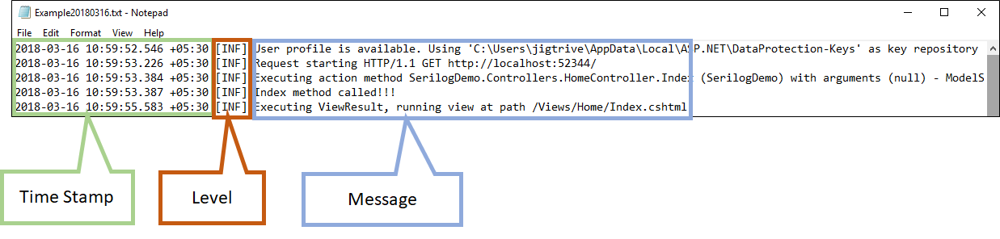
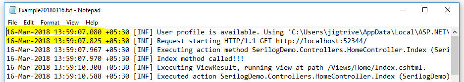

### Introduction 
[Logging](https://github.com/jignesht24/Aspnetcore/blob/master/Logging%20with%20.net%20core%202.0/Basic%20Logging%20Framework/Readme.md)  is a very critical and essential part of any software. It helps us in the investigation of the essence of problems. ASP.NET Core has built-in support for logging API's, which is able to work with various logging providers. Using these built-in providers, we can send application logs to one or more destinations and also, we can plug in third party logging frameworks such as Serilog, Nlog, etc.

Serilog is a good logging framework and it is built with the structured log data in mind. It is a kind of serializer. Serilog determines the right representation when the properties are specified in log events. To use Serilog logging feature with ASP.NET core 2.0, we need to add the dependency of "Serilog.AspNetCore". Serilog provides variety of [sinks](https://github.com/serilog/serilog/wiki/Provided-Sinks) such as file, MSSQL, Log4net, PostgreSQL,  etc.

In this artcle, I will explain about serilog File sink with Asp.net core 2.0. After adding respective package of serilog, we need to add UseSerilog() to the web host builder in BuildWebHost().
```
public static IWebHost BuildWebHost(string[] args) =>
    WebHost.CreateDefaultBuilder(args)
        .UseStartup<Startup>()
        .UseSerilog()
        .Build();
```

To write log data in to the file, we need to use "Serilog.Sinks.File" dependency. It writes Serilog event to one or more file based on configuration. We can add this sinks by using either nuget package manager or .net CLI

Using Package Manager
```
PM> Install-Package Serilog.Sinks.File
```
Using .net CLI
```
> dotnet add package Serilog.Sinks.File
```
To configure the sink in c# code, we need to call WriteTo.File method during logger configuration. The logger configuration are need to write in program.Main 
```
Log.Logger = new LoggerConfiguration()
                .MinimumLevel.Information()
                .MinimumLevel.Override("SerilogDemo", LogEventLevel.Information)
                .WriteTo.File("Logs/Example.txt")
                .CreateLogger(); 
```
By default, log file size lime is 1GB but it can be increased or removed using the fileSizeLimitBytes parameter of WriteTo.File method.
```
.WriteTo.File("Logs/Example.txt", fileSizeLimitBytes: null)
```
We can also create log file per year, month, day, hour, or minute by specify rollingInterval parameter to WriteTo.File method. In following example, I have define rollingInterval to RollingInterval.Day so it will create new log file every day.
```
.WriteTo.File("Logs/Example.txt", rollingInterval: RollingInterval.Day)
```
Serilog retained most recent 31 files by default for some reason. We can change or remove this limit using retainedFileCountLimit parameter. In following example, I have assign this parameter to null, so it remove limitation of 31 log files.
```
 .WriteTo.File("Logs/Example.txt", rollingInterval: RollingInterval.Day, retainedFileCountLimit: null)
```
 ### Controlling Text file formatting

 The File sink creates events in sepecific fix format by default. Following is fixed format


The file format controls by using outputTemplate parameter to WriteTo.File method. Following is default format of output template
```
 .WriteTo.File("Logs/Example.txt",
    outputTemplate: "{Timestamp:yyyy-MM-dd HH:mm:ss.fff zzz} [{Level:u3}] {Message:lj}{NewLine}{Exception}")
```
Example: I have made little change in time stamp formating to "dd-MMM-yyyy HH:mm:ss.fff zzz", it will show datetime format accordingly in log file



#### Shared log files
Only process may write to the log file at a time by default. Serilog sinks enable us to multi-process shared log files by setting shared parameter of WriteTo.File is to true.
```
.WriteTo.File("Logs/Example.txt", shared: true)
```
We can also do same configuration using JSON configuration. To use JSON configuration, we need to add/install package "Serilog.Settings.Configuration". 

Instead of configuring the logger in code, we can read from JSON configuration file by calling ReadFrom.Configuration() method.

In our application, we can do configuration in appsettings.json file. Here we need to specify the file sink assembly and required path format under the "Serilog" node.

The parameters which can be set through the Serilog-WriteTo-File keys are the method parameters accepted by the WriteTo.File() configuration method. In following example, I have created appSetting.json file that contains serilog file sink configuration. In file configuration, text file is created under logs folder with customized output template.

appsettings.json
```
{
  "Serilog": {
    "Using": [ "Serilog.Sinks.File" ],
    "MinimumLevel": "Information",
    "WriteTo": [
      {
        "Name": "File",
        "Args": {
          "path": "Logs\\Example.txt", // log file path
          "rollingInterval": "Day", // Rolling Interval
          "outputTemplate": "{Timestamp:dd-MMM-yyyy HH:mm:ss.fff zzz} [{Level:u3}] {Message:lj}{NewLine}{Exception}"
        }
      }
    ]
  }
}
```
Before creating logger, we need to add this configuration file to ConfigurationBuilder object and The ConfigurationBuilder object is need to pass to ReadFrom.Configuration method of LoggerConfiguration.
```
var configuration = new ConfigurationBuilder()
.AddJsonFile("appsettings.json")
.Build();

Log.Logger = new LoggerConfiguration()
    .ReadFrom.Configuration(configuration)
    .CreateLogger();
 ```
