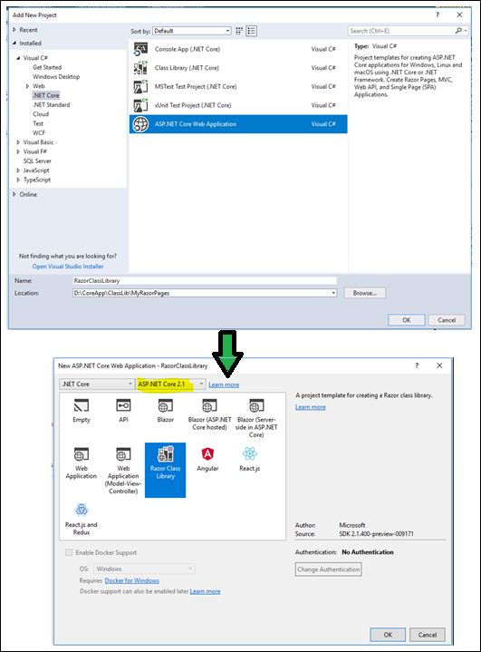
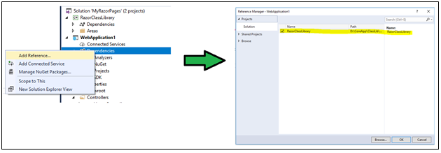
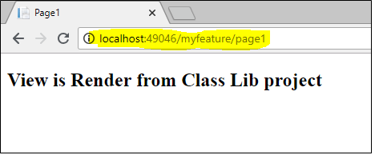
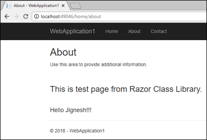
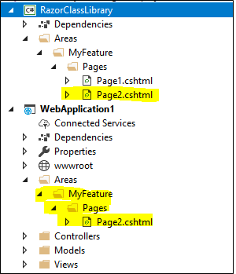
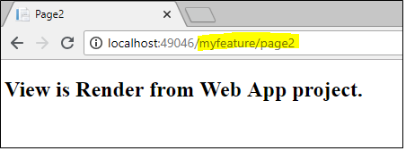

### Introduction to Razor page

Razor Pages is new feature introduced with asp.net core 2.0. They are much like MVC pages and have most of the feature of MVC but they are more focused UI implementation. It is based on the page-Centric development model like ASP.net web pages & web forms. It contains all the feature of ASP.net core and it suitable for all kind of application.
```
@page
<h1> Hello, Reader!</h1>
<h2> This is Razor Pages Demo </h2>
```
The preceding code is example of Razor pages. It is mostly look like as a Razor view file except @page directive. The @page directive makes the file in to MVC action. It means that it handles requests directly (without the use of controller). 

Razor page comes with code-bind file that inherit from PageModel class. Mostly code behind file has similar name as Razor page. This file may have handler method like OnGet and OnPost. The OnGet handler method used to  initialize state needed for the page and OnPost is used to handle page submit event. The Async method for the handler methods are also available.

### Razor Class Library project
ASP.net core 2.1 introduces Razor Class Library (RCL) project. It is library that contains pages, views, vew component, controllers, data models. It can be reused and can also packaged. It is easy way to share web applications code with UI elements across the multiple projects.  We can also packaged into a NuGet package.

How to create Razor Class Library project
We can create Razor Class Library project by using either Visual Studio or using .net core CLI. With Visual Studio, the RCL template is available. 



We can also create project using CLI with help of "dotnet new razorclasslib" command.
```
dotnet new razorclasslib -o RazorClassLibrary 
```
Now we can add Razor pages to the RCL projects. This template by default create "Areas" folder. 

To demonstrate the concept, I have replace following markup in "RazorClassLibrary\Areas\MyFeature\Pages\Page1.cshtml"
```
@page
@model RazorClassLibrary.MyFeature.Pages.Page1Model
@{
    Layout = null;
}
<!DOCTYPE html>
<html>
<head>
    <meta name="viewport" content="width=device-width" />
    <title>Page1</title>
</head>
<body>
    <h2>
        View is Render from Class Lib project
    </h2>
</body>
</html>
```

### Share UI element with multiple project
To share UI element that create in RCL (Razor Class Library), we need to take reference of RCL project to the project in which we want to use UI element.

To demonstrate the concept, I have created "ASP.NET Core Web Application" project and add the reference of RCL project.



To verify, our page load from Razor Class Library browser the URL "/MyFeature/Page1".



Also we can share Razor view between multiple project using Razor Class Library project. To demonstrate, I have created Razor view text.cshtml under "Pages\shared" folder in Razor Class Library project and this page has following mark-up.

##### test.cshtml
```
@model RazorClassLibrary.Model.TestModel
<h3>
    This is test page from Razor Class Library.
</h3>
<br />
<h4>Hello @Model.Name!!! </h4>
```
Using following code, I can render this Razor view as partial view.
```
<partial name="test" model=@ViewData["testMode"]>
```


### Override Pages (View / Partial View)
When a View, Partial View or Razor pages is found in both web application (local application) and as well as Razor Class Library, local file will have first precedence. For example If I add Razor Page to "WebApplication1\Areas\MyFeature\Pages\Page2.cshtml" and   "RazorClassLibrary\Areas\MyFeature\Pages\Page2.cshtml", Web application will take precedence over Page2 in the Razor Class Library.




### Summary
RCL (Razor Class Library) is best way to share web application components and UI artifacts. It enables us to share component between project even if they are not in same solution. We can also create NuGet packages for this library. It always possible to override  view, partial view and other components. 
