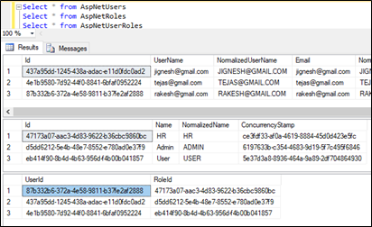

### Introduction

Authorization is a process that determines what a user is able to do. For example, an Admin user is allowed to install/remove a software from a computer and a non-Admin user can use the software from the computer. It is independent and orthogonal from authentication. However, authorization requires an authentication mechanism. For applications, the first step is always authentication and then authorization.

Identity is membership system that allows us to add login functionality to our application and Identity may belongs to one or more roles. For Example, "User1" is belong to "Admin" role and "User2" belong to "HR" role. 

Using AuthorizeFilter, we can control the access in our MVC / Web API application by specifying this attribute in controller or action method. Role based authorization checks whether login user role has access to the page or not. Here developer embeds the roles with their code. 

To demostrate example, I have created 3 roles and 3 users and map user with roles. I have achieve this by using following code.
```
public void Configure(IApplicationBuilder app, IHostingEnvironment env, IServiceProvider serviceProvider)
{
	....
	....
	app.UseMvc(routes =>
	{
		routes.MapRoute(
			name: "default",
			template: "{controller=Home}/{action=Index}/{id?}");
	});

	CreateRoles(serviceProvider).Wait();
}

private async Task CreateRoles(IServiceProvider serviceProvider)
{
    //initializing custom roles 
    var RoleManager = serviceProvider.GetRequiredService<RoleManager<IdentityRole>>();
    var UserManager = serviceProvider.GetRequiredService<UserManager<IdentityUser>>();
    string[] roleNames = { "Admin", "User", "HR" };
    IdentityResult roleResult;

    foreach (var roleName in roleNames)
    {
        var roleExist = await RoleManager.RoleExistsAsync(roleName);
        if (!roleExist)
        {
            //create the roles and seed them to the database: Question 1
            roleResult = await RoleManager.CreateAsync(new IdentityRole(roleName));
        }
    }

    IdentityUser user = await UserManager.FindByEmailAsync("jignesh@gmail.com");

    if (user == null)
    {
        user = new IdentityUser()
        {
            UserName = "jignesh@gmail.com",
            Email = "jignesh@gmail.com",
        };
        await UserManager.CreateAsync(user, "Test@123");
    }
    await UserManager.AddToRoleAsync(user, "Admin");


    IdentityUser user1 = await UserManager.FindByEmailAsync("tejas@gmail.com");

    if (user1 == null)
    {
        user1 = new IdentityUser()
        {
            UserName = "tejas@gmail.com",
            Email = "tejas@gmail.com",
        };
        await UserManager.CreateAsync(user1, "Test@123");
    }
    await UserManager.AddToRoleAsync(user1, "User");

    IdentityUser user2 = await UserManager.FindByEmailAsync("rakesh@gmail.com");

    if (user2 == null)
    {
        user2 = new IdentityUser()
        {
            UserName = "rakesh@gmail.com",
            Email = "rakesh@gmail.com",
        };
        await UserManager.CreateAsync(user2, "Test@123");
    }
    await UserManager.AddToRoleAsync(user2, "HR");

} 
```


We can specify the roles that have access to the requested resource using Roles property of Authorize attribute. For example, following code allows to access the action method to users who are member of "Admin" role.
```
[Authorize(Roles = "Admin")]
public IActionResult OnlyAdminAccess()
{
    ViewData["role"] = "Admin";
    return View("MyPage");
}
```
We can specify multiple roles as a comma separated list. For example, following code snippet, action method would be only ccessible by users who are members of either "Admin" or "User".
```
[Authorize(Roles = "Admin,User")]
public IActionResult MultipleAccess()
{
    ViewData["role"] = "Admin";
    return View("MyPage");
}
```
We can also apply multiple Authorize attribute and specified the role that has access
```
[Authorize(Roles = "Admin")]
[Authorize(Roles = "User")]
public IActionResult MultipleAccess()
{
    ViewData["role"] = "Admin";
    return View("MyPage");
}
```
### Policy based role checks
We can also create new policy that expressed to role requirement. We can add & register policy using Authorization service configuration. In following code snippet, I have created the policy that allow to access only users who are members of "Admin".
```
 public void ConfigureServices(IServiceCollection services)
 {
	....
	....
	services.AddAuthorization(options =>
    {
        options.AddPolicy("OnlyAdminAccess", policy => policy.RequireRole("Admin"));
    });
 }
```
We can apply the policy to AuthorizeAttribute using "Policy" property.
```
[Authorize(Policy = "OnlyAdminAccess")]
public IActionResult PolicyExample()
{
    ViewData["role"] = "Admin";
    return View("MyPage");
}
```
Using this policy method, we can also do role based authorization for Razor pages. For example, if I have Razor page "Test1.cshtml" and this page can only be access by the user having "Admin" role, following code help us to add authorization for this razor page.
```
public void ConfigureServices(IServiceCollection services)
{
	...
	...
	services.AddMvc().AddRazorPagesOptions(options =>
    {
        options.Conventions.AuthorizePage("/test1", "OnlyAdminAccess");


    }).SetCompatibilityVersion(CompatibilityVersion.Version_2_1);

    services.AddAuthorization(options =>
    {
        options.AddPolicy("OnlyAdminAccess", policy => policy.RequireRole("Admin"));
    });
}
```
