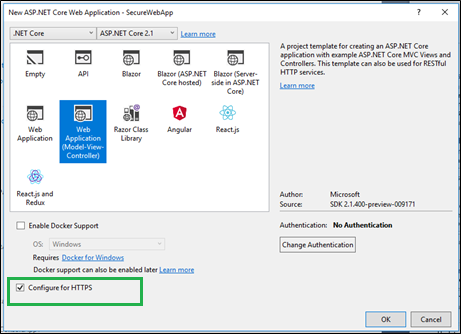
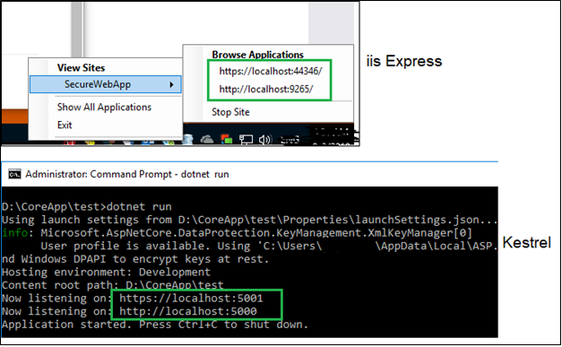
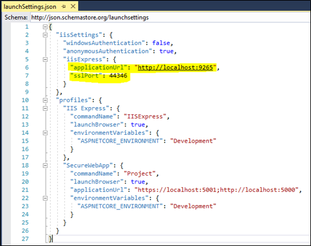

### Configuring HTTPS in ASP.NET Core 2.1

#### Introduction
HTTPS can be configured with ASP.net core before the .net core framework 1.1 but it was tricky to configure. It was make easier to configure in 2.0 but this configuration is not by default. In this article, we learn about how to configured HTTPS and how to customize it.

 When we create a web application with Visual studio, we have an option to configure our application for HTTPS.



 When we create the application using CLI, by default web application configure for HTTPS. Using following command, we can turn off HTTPS.
 ```
 >dotnet new mvc --no-https
 ```
 When we run this application either on iisexpress or Kestrel, is listening on two ports, one for http and other for https.
 

 
#### HTTP Strict Transport Security Protocol (HSTS)
When we look at Configure method of Startup class, some new middlewares used to prepare this web to configure HTTPS. One of them is HSTS. 

HTTP Strict Transport Security (HSTS) is a web security policy which helps to protect web application against cookie hijacking and downgrade protocol attacks. It allows web server to communicate with client over secure HTTPS connections, never on insecure HTTP protocol. It helps to reject insecure connections in the first place. 
```
public void Configure(IApplicationBuilder app,, IHostingEnvironment env)
{
	...
	...
	if (!env.IsDevelopment())
    {
		...
		app.UseHsts();
		...
	}
	...
	...
	app.UseMvc();
} 
```
UseHsts is not recommended to use in development environment because HSTS header is cacheable by the browsers. Base on our requirement, we can configured HSTS.

Following HSTS options we can configured
* MaxAge: set the max age of Strict-Transport-Security header. It default value is 30 days. It is TimeSpan type of parameter.
* IncludeSubDomains: It is boolean type of property that enables  includeSubDomain parameter of the Strict-Transport-Security header.
* Preload: It is used to get or set the preload parameter of the Strict-Transport-Security header. Preload is not part of the RFC HSTS specification, but supported by the browsers to preload HSTS sites on fresh install.

Apart from this we can also add the list of host name that will not add the HSTS header. 

```
public void ConfigureServices(IServiceCollection services)
{
    services.AddMvc();

    services.AddHsts(options =>
    {
        options.IncludeSubDomains = true;
		options.Preload = true;
        options.MaxAge = TimeSpan.FromDays(120);
        options.ExcludedHosts.Add("TestDomain.com");
    });
}
```
#### Https Redirection
Another middleware added by default that redirect all the request on insecure http to secure http. In above example if we talk about, all the calls from " http://localhost:5000" are immediately redirected to " https://localhost:5001". This can be refer as a enforce HTTPS.
```
public void Configure(IApplicationBuilder app)
{
	...
	...
	app.UseHttpsRedirection();
	app.UseMvc();
}
```

The method UseHttpsRedirection is use default redirect status code (Status307TemporaryRedirect) and default https port (443). We can add AddHttpsRedirection method to configure middleware option for default status code and https port.
```
public void ConfigureServices(IServiceCollection services)
{
    services.AddMvc();
	...
	...
	services.AddHttpsRedirection(options =>
    {
        options.RedirectStatusCode = StatusCodes.Status307TemporaryRedirect;
        options.HttpsPort = 5001;
    });
}
```
Alternatively we can specify the HTTPS port by using configuration or the ASPNETCORE_HTTPS_PORT environment variable. This can be very useful when HTTPS is being handled from external application such as IIS. For example, the project template add ASPNETCORE_HTTPS_PORT environment variable to the IIS Express launch profile (launchSettings.json), so that it matched the HTTPS port setup for IIS Express.



#### Summary
This new feature will make it easier to use HTTPS during development and in production. 