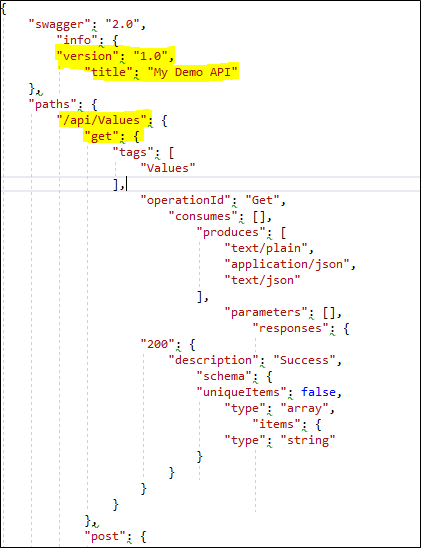
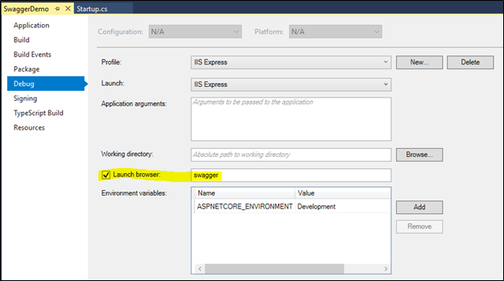
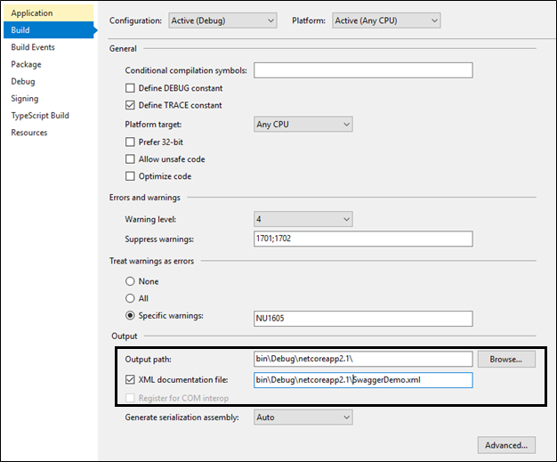
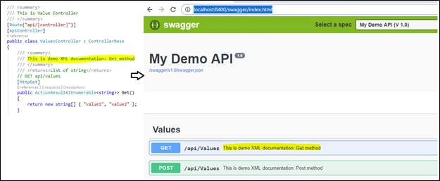
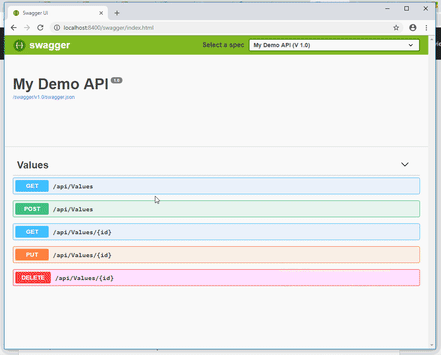

## Introduction to Swagger with ASP.net Core Web API

### Introduction
Testing of Web API is a always challenge because it exposes end-point rather than the UI (that easy understand). Test such things may have dependency of third-party tools such as fiddler and Post-Man to Web API end points. The Swagger is resolved this issue. It provides UI representation of the RESTful API without any implementation logic. It allows user to understand capabilities of a service without any code access and it also reduce the amount of time to create service document.

The Swagger is generated UI using the Swagger specification file (swagger.json) that is generated by Swagger tool based on service code. This file describes the capabilities of service i.e. How many methods are supported by service and provide information about method parameter. Using this file, Swagger UI generate client code. Following is example of swagger.json file.



Swagger can be implemented in ASP.net core web API using Swashbuckle.AspNetCore and NSwag package. Both are open source project to generate Swagger documents for ASP.NET Core Web API. Additionally NSwag also provides the approaches to generate TypeScript client code as well as C# servercode for API.

### Configure Swagger in ASP.net Core Web API using Swashbuckle.AspNetCore

Following are the step to configure Swagger in ASP.net Core Web API using Swashbuckle.AspNetCore.

##### Step:1 Install package Swashbuckle.AspNetCore
Using the following command, we can install package of Swashbuckle.AspNetCore
```
PM> Install-Package Swashbuckle.AspNetCore
```
##### Step:2 Configure Swagger middleware
To add Swagger middle to the request pipeline, we need to AddSwaggerGen method in ConfigureService method of startup class. Here, we can define one or more Swagger documents.

Startup.cs
```
public void ConfigureServices(IServiceCollection services)
{
    services.AddMvc().SetCompatibilityVersion(CompatibilityVersion.Version_2_1);
    services.AddSwaggerGen(c =>
    {
        c.SwaggerDoc("v1.0", new Info { Title = "My Demo API", Version = "1.0" });
    });
}
```
If want to enable this middleware, we need to call UseSwagger method in configure method of startup class. Here also we need to configure SwaggerEndpoint to generate UI. The UseSwaggerUI is add static file middleware to load swagger.json file.
```
public void Configure(IApplicationBuilder app, IHostingEnvironment env)
{
    if (env.IsDevelopment())
    {
        app.UseDeveloperExceptionPage();
    }
    else
    {
        app.UseHsts();
    }

    app.UseHttpsRedirection();

    app.UseSwagger();
    app.UseSwaggerUI(c =>
    {
        c.SwaggerEndpoint("/swagger/v1.0/swagger.json", "My Demo API (V 1.0)");
    });
    app.UseMvc();
}
```
The above steps required to setup Swagger. If we want to launch Swagger in development enviorment using Visual studio, one more change is required. To set Swagger UI, go to project property - debug tab and change  Launch Browser value to "swagger".



When we run the application, we can see following Swagger UI for ValuesContoller.


As we seen here, it use different color code for each HTTP verb. When we click on any action method it will asking for parameter detail and click on excecute button it will send request to web API.

The Swagger required minimum configuration and configuration to test our web API. It also shows XML comments when generating UI but that required some configuration.

The .net /.net core framework provides a way to write XML comment for the documentation. In .net core, we can enble XML comments by setup "XML documentation file" property under build tab of project property windows.



Swagger UI does not shows this documentation by default. We need to pass path to IncludeXMLComments. 
```
public void ConfigureServices(IServiceCollection services)
{
    services.AddMvc().SetCompatibilityVersion(CompatibilityVersion.Version_2_1);
    services.AddSwaggerGen(c =>
    {
        c.SwaggerDoc("v1.0", new Info { Title = "My Demo API", Version = "1.0" });
        c.IncludeXmlComments(System.IO.Path.Combine(System.AppContext.BaseDirectory, "SwaggerDemo.xml"));
    });
}
```


### Configure Swagger in ASP.net Core Web API using NSwag

Following are the step to configure Swagger in ASP.net Core Web API using NSwag.AspNetCore
##### Step:1 Install-Package NSwag.AspNetCore
Using the following command, we can install package of NSwag.AspNetCore
```
PM> Install-Package NSwag.AspNetCore
```
##### Step:2 Configure Swagger middleware
To add Swagger middle to the request pipeline, we need to AddSwaggerDocument method in ConfigureService method of startup class. This method adds default document with name "V1". If we want to add more than one document, call this method multiple time with different document name.

Startup.cs
```
public void ConfigureServices(IServiceCollection services)
{
    services.AddMvc().SetCompatibilityVersion(CompatibilityVersion.Version_2_1);
    services.AddSwaggerDocument();
}
```
If want to enable this middleware, we need to call UseSwagger method in configure method of startup class. This method adds default route as "/swagger/{documentName}/swagger.json" Also we need to call UseSwaggerUi3 method to add the Swagger UI to request pipeline.
```
public void Configure(IApplicationBuilder app, IHostingEnvironment env)
{
    if (env.IsDevelopment())
    {
        app.UseDeveloperExceptionPage();
    }
    else
    {
        app.UseHsts();
    }

    app.UseHttpsRedirection();

    app.UseSwagger();
	app.UseSwaggerUi3();

    app.UseMvc();
}
```
The above steps required to setup Swagger. If we want to launch Swagger in development enviorment using Visual studio, one more change is required. To set Swagger UI, go to project property - debug tab and change  Launch Browser value to "swagger".



##### Summary
The Swagger help us to test our web API without any third party tool and custom code. In this article I have explain how to configure Swagger using Swashbuckle and NSwag.
