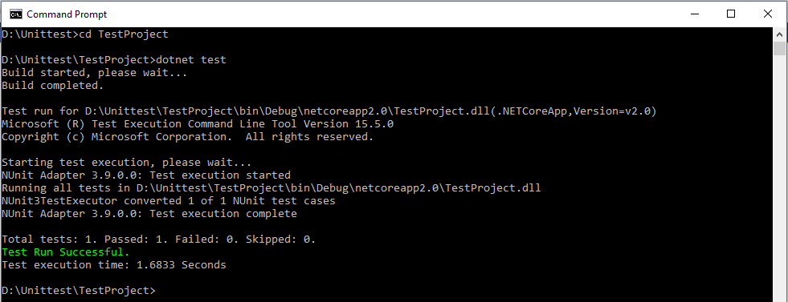
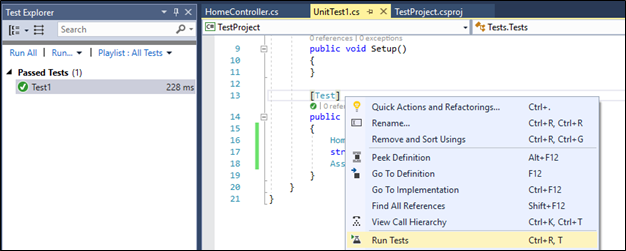
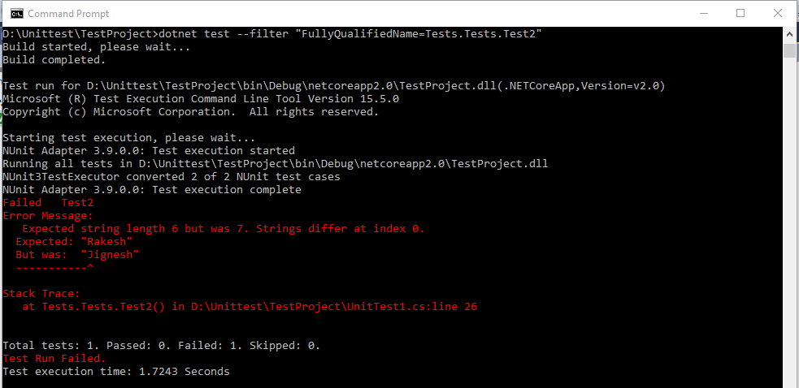

## Introduction

There are three different test frameworks are supported for unit test with asp.net core: MSTest, xUnit and NUnit that allow us to test our code in consistent way. In this article, I will explain about the unit test in asp.net core using NUnit.

The NUnit is an open source unit test framework for all .net languages. It initially ported from JUnit. The current released version is 3 and it has been completely rewritten with many new features. 

To demonstrate the example of unit test, I have created MVC project, solution and Unit test project by using CLI (Command Line Interface). To create MVC and Test project, I am following below steps

1) Create Solution file using following command. This command creates empty solution.
```
>dotnet new sln -n MVCUnittest 
```
2) Creating MVC Project: Using following command, MVC project will be created
```
>dotnet new MVC
```
3) Adding this project to solution: Using following command we can add project to solution
```
>dotnet sln add Unittest\Unittest.csproj
```
4) Create NUnit test project:
There is no direct template available for NUnit by default. If we want template for NUnit, we need to install by using following command.
```
>dotnet new -i NUnit3.DotNetNew.Template
```
Alternate way, we can create class library project and add reference of NUnit. Current version of NUnit is 3. It can be installed either from nuget packages or from dot core CLI tool. Following command is used to installed NUnit using nuget packages (Package Manager) 
```
PM>Install-Package NUnit -Version 3.9.0
```
Using Following dotnet CLI command, we can install NUnit.
```
>dotnet add package NUnit --version 3.9.0
```
If template for NUnit has been installed, we can create NUnit project using following command.
```
>dotnet new nunit
```
This command creates NUnit Test Project and generated template configures Test runner into .csproj file
```
<ItemGroup>
  <PackageReference Include="nunit" Version="3.9.0" />
  <PackageReference Include="NUnit3TestAdapter" Version="3.9.0" />
  <PackageReference Include="Microsoft.NET.Test.Sdk" Version="15.5.0" />
</ItemGroup>
```
The generated code also has dummy unit test file. It looks as following
```
using NUnit.Framework;

namespace Tests
{
    public class Tests
    {
        [SetUp]
        public void Setup()
        {
        }

        [Test]
        public void Test1()
        {
            Assert.Pass();
        }
    }
}
```
NUnit has very similar attribute terminology as MSTest has. The TextFixture is same as TestClass attribute in MSTest, it denote a class that contains unit test. The Test attribute is same as TestMethod attribute in MSTest, it denote a method is a test method. The SetUp attribute is used to identify a method which is call immediately before each test.

5) Adding test project to solution 
```
>dotnet sln add TestProject\Testproject.csproj
```
To demonstrate concept, I have created method within HomeController class (GetEmployeeName). This method accepts empId as parameter and based on this, it will return name of employee or "Not Found" hard code string.

HomeController
```
public string GetEmployeeName(int empId)
{
    string name;
    if (empId == 1)
    {
        name = "Jignesh";
    }
    else if (empId == 2)
    {
        name = "Rakesh";
    }
    else
    {
        name = "Not Found";
    }
    return name;
}
```

In the following test method, I have pass hardcoded value and check result using Assert class. 

UnitTest1.cs
```
using NUnit.Framework;
using UnitTest.Controllers;

namespace Tests
{
    public class Tests
    {
        [SetUp]
        public void Setup()
        {
        }

        [Test]
        public void Test1()
        {
            HomeController home = new HomeController();
            string result = home.GetEmployeeName(1);
            Assert.AreEqual("Jignesh", result);
        }
    }
}
```
Final step is to run the Unit test. Using following command, we can run our all test cases.
```
>dotnet test
>dotnet test --filter "FullyQualifiedName=TestProject.UnitTest1.Test1"
```
Result



We also run all test cases or individual test within visual studio using Test Explore.


In the preceding example, my test result (actual) is match with expected result. In following example, my actual result is not match with expected result.
```
[Test]
public void Test2()
{
    HomeController home = new HomeController();
    string result = home.GetEmployeeName(1);
    Assert.AreEqual("Rakesh", result);
}
```
Result


To unit test every block of code, we require more test data. We can add more test method using Test attribute, but it is very tedious job. The NUnit is also support other attribute which enable us to write a suite for similar test. A TestCases attribute can be applied to the test that can take test data directly using provided data or excel spread sheet.  Instead of creating new test, we can use this attribute to create a single data driven test.  

The TestCase attribute may appear one or more time on a test method that contains the test data as a parameters. The method may optionally marked with Test attribute as well.
```
using NUnit.Framework;
using UnitTest.Controllers;

namespace Tests
{
    public class Tests
    {
        [TestCase(1, "Jignesh")]
        [TestCase(2, "Rakesh")]
        [TestCase(3, "Not Found")]
        public void Test3(int empId, string name)
        {
            HomeController home = new HomeController();
            string result = home.GetEmployeeName(empId);
            Assert.AreEqual(name, result);
        }
    }
}
```
Unit test with ILogger 
The .net core support built-in dependency injection. So, whatever the services, we want to use during the execution of the code are injected as dependency. One of the best example is ILogger service. Using following code, we can configure ILogger service in our asp.net core project.

Configure ILogger in Program.cs
```
using Microsoft.AspNetCore;
using Microsoft.AspNetCore.Hosting;
using Microsoft.Extensions.Logging;

namespace Unittest
{
    public class Program
    {
        public static void Main(string[] args)
        {
            BuildWebHost(args).Run();
        }

        public static IWebHost BuildWebHost(string[] args) =>
            WebHost.CreateDefaultBuilder(args)
                .ConfigureLogging((hostingContext, logging) =>
                {
                    logging.AddConfiguration(hostingContext.Configuration.GetSection("Logging"));
                    logging.AddConsole();
                    logging.AddDebug();
                })
                .UseStartup<Startup>()
                .Build();
    }
}
```

TestController
```
using Microsoft.AspNetCore.Mvc;
using Microsoft.Extensions.Logging;

namespace Unittest.Controllers
{
    public class TestController : Controller
    {
        private readonly ILogger _logger;
        public TestController(ILogger<TestController> logger)
        {
            _logger = logger;
        }
        
        public string GetMessage()
        {
           _logger.LogDebug("Test Method Called!!!");
            return "Hi! Reader";
        }
    }
}
```
### Unit Test Method
To unit test controller having dependency on ILogger service, we have to pass ILogger object or null value to constructor. To create these type dependencies, we can create object of service provider and help of the service provide, we can create the object of such services. 

In the following code, I have created service provider object and create ILogger object.
```
[Test]
public void Test4()
{
    var serviceProvider = new ServiceCollection()
        .AddLogging()
        .BuildServiceProvider();

    var factory = serviceProvider.GetService<ILoggerFactory>();

    var logger = factory.CreateLogger<TestController>();
    TestController home = new TestController(logger);
    string result = home.GetMessage();
    Assert.AreEqual("Hi! Reader", result);
}
```

### Summary
Unit test is a code that helps us in verifying the expected behaviour of the other code in isolation. Here “In isolation" means there is no dependency between the tests. This is a better idea to test the Application code, before it goes for quality assurance (QA). All Unit test frameworks, MSTest, XUnit and NUnit, offer a similar end goal and help us to write unit test simpler, easier and faster. It is possible to use NUnit with .net core but some things need to do manually this is due to there is no template available with .net core. 